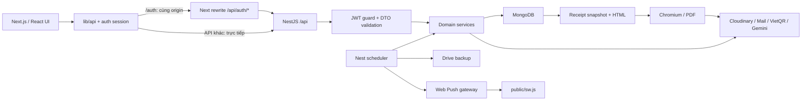
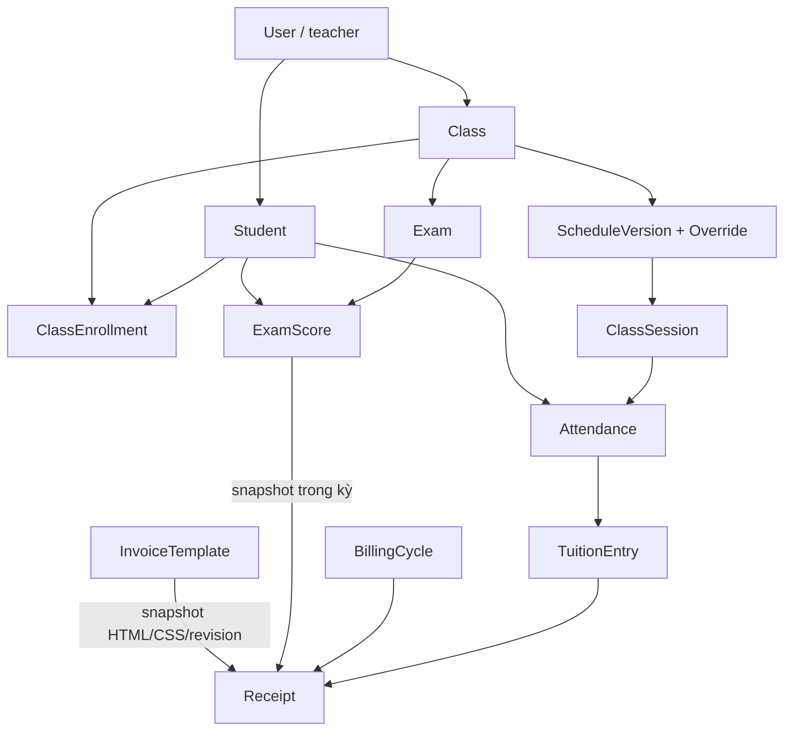

# EduTrack — tài liệu tham chiếu toàn dự án BE + FE

Mốc đọc và đối chiếu nghiệp vụ: **06/10/2026, Asia/Ho_Chi_Minh**.

Mốc khảo sát ban đầu: backend tại `ae00d7b508c9a3fdaf5a2f51cca307ed30d1c94a`; frontend tại `12437b0f87f74df9223d5b245cac25536592c176`. Ngày 06/10/2026 tiếp tục bổ sung danh sách thiết bị nhận thông báo ở mục 14.4/14.6 và sửa buổi tạm hiện lại sau thu hồi ở mục 8.4/18.7. Chỉ mục và snapshot phản ánh source local tại lần sinh gần nhất; các mốc này không xác nhận phiên bản đang chạy trên Render/Vercel.

Tài liệu này dành cho người bảo trì và coding agent. Mục đích là tìm đúng nơi sửa, hiểu quy tắc đang chạy và chọn kiểm thử phù hợp mà không phải đọc lại dự án từ đầu. Các nhận xét “hiện tại” là kết quả đối chiếu mã ở mốc trên, không phải cam kết mọi trường hợp đã được kiểm thử trên production.

## 1. Cách đọc để tiết kiệm token

1. Đọc bảng tra cứu ở mục 2 và mục nghiệp vụ liên quan.
2. Trong backend, chạy `node scripts/project-index.cjs --check`. Nếu có thay đổi, chỉ đọc diff/file được báo và cập nhật nhận định.
3. Khi cần chính xác tên hàm, field, validation, route hoặc test, tìm đường dẫn/symbol trong [project-code-index.md](project-code-index.md).
4. Đọc code của method đích và các bên gọi trực tiếp trước khi sửa. Với tiền, auth, lịch và quyền sở hữu, đọc thêm mục bất biến ở cuối tài liệu.
5. Sau sửa: cập nhật hướng dẫn nghiệp vụ trước, rồi chạy `node scripts/project-index.cjs` để làm mới chỉ mục/snapshot.

**Không nạp toàn bộ chỉ mục hoặc JSON snapshot vào context.** Dùng `rg -n` để tìm tên, rồi đọc một đoạn quanh kết quả. Chỉ mục có đầy đủ danh sách file, imports, exports, chữ ký method, schema/DTO decorators, enum/type contracts, API calls và tên test; hướng dẫn này giải thích ý nghĩa và quan hệ giữa chúng.

Phạm vi khảo sát gồm source BE/FE, cấu hình, test và tài nguyên văn bản. Dependencies, build artifacts, binary ảnh/font, log, file OAuth/service account, `.env` thật và dữ liệu backup không phải mã ứng dụng để đọc lại. Không ghi DB hoặc gọi API làm thay đổi dữ liệu trong lần lập tài liệu này.

Các link BE bắt đầu `../src`; link FE bắt đầu `../../edutrack_fe`. Link FE dùng khi hai repo đặt cạnh nhau trong workspace; trình xem GitHub của riêng repo BE có thể không mở được link sang repo FE. Đường dẫn ghi trong bảng vẫn là khóa tra cứu.

### Mục lục nghiệp vụ

| Mục | Nội dung |
| --- | --- |
| [2](#2-bảng-tra-cứu-theo-yêu-cầu-thay-đổi) | Tìm file cần sửa theo chức năng |
| [3](#3-kiến-trúc-runtime-và-cấu-trúc-repository) | Runtime, module và cấu trúc repo |
| [4](#4-frontend-routes-state-và-lớp-api) | Routes, state, API client |
| [5](#5-database-quan-hệ-và-index) | Collections, quan hệ, enum, index |
| [6](#6-auth-otp-và-vòng-đời-phiên-đăng-nhập) | Auth, OTP, refresh cookie |
| [7](#7-học-sinh-lớp-và-enrollment) | Hồ sơ, import, lớp, enrollment |
| [8](#8-lịch-học-múi-giờ-trùng-lịch-và-buổi-học) | Lịch cố định/tạm thời, conflict, giờ trống |
| [9](#9-điểm-danh-giá-theo-ngày-và-học-phí-phát-sinh) | Điểm danh, xóa điểm danh, giá/học phí |
| [10](#10-bài-kiểm-tra-điểm-số-và-minh-chứng) | Bài kiểm tra, điểm và file |
| [11](#11-hóa-đơn-một-lớp-và-gộp-nhiều-lớp) | Preview, issue, payment, cancel |
| [12](#12-thiết-kế-mẫu-hóa-đơn-và-render-pdf) | GrapesJS, snapshot, PDF |
| [13](#13-hồ-sơ-giáo-viên-ngân-hàng-qr-và-media) | Hồ sơ, VietQR, Cloudinary, upload |
| [14](#14-dashboard-ai-thông-báo-và-pwa) | Dashboard, AI, push, cron, service worker |
| [15](#15-backup-google-drive-và-vận-hành-trên-render) | Backup, OAuth, catch-up, giới hạn |
| [16](#16-api-contract-và-quy-ước-requestresponse) | Nhóm API, payload, lỗi, multipart |
| [17](#17-biến-môi-trường-build-và-triển-khai) | Env, chạy local, Render/Vercel |
| [18](#18-kiểm-thử-và-bằng-chứng-xác-minh) | Test cần chạy theo loại thay đổi |
| [19](#19-công-thức-thay-đổi-và-các-bất-biến) | Quy trình thêm/sửa tính năng |
| [20](#20-điểm-cần-xử-lý-và-nội-dung-kế-hoạch-chưa-có-trong-code) | Gaps đã thấy, kế hoạch cũ |
| [21](#21-chẩn-đoán-lỗi-theo-triệu-chứng) | Tra cứu lỗi thực tế |
| [22](#22-duy-trì-tài-liệu-và-đọc-diff-thay-vì-đọc-lại-toàn-bộ) | Cập nhật tài liệu/snapshot |

## 2. Bảng tra cứu theo yêu cầu thay đổi

Đường dẫn BE dưới `edutrack_be/`, FE dưới `edutrack_fe/`. Phần lớn nghiệp vụ lớp/điểm danh/điểm số vẫn nằm trong `ClassesService`; tên module không phản ánh một service nhỏ cho từng tab.

| Yêu cầu | Backend đọc/sửa trước | Frontend đọc/sửa trước | Kiểm thử liên quan |
| --- | --- | --- | --- |
| Đăng nhập, OTP, đăng ký, quên mật khẩu | `src/modules/auth/{auth.service,auth.controller}.ts`, `dto/`, `users/schemas/user.schema.ts`, `mail/` | `components/auth/*-form.tsx`, `lib/api/auth.ts`, `types/auth.ts` | `auth.controller.spec.ts`, FE session tests; cần bổ sung service test khi sửa nghiệp vụ |
| Mất phiên, refresh, nhiều tab, đổi tài khoản | AuthService `createAuthSession/refresh/logout`, JWT strategy, cookie controller | `lib/api/client.ts`, `lib/api/url.ts`, `lib/auth/*`, `dashboard-shell.tsx`, `next.config.ts` | `tests/session-persistence.spec.ts`, `access-token.test.mjs`, `session-routing.test.mjs` |
| Hồ sơ giáo viên, đổi mật khẩu | `users.service.ts`, `users.controller.ts`, profile/password DTO | `components/profile/*`, `lib/api/profile.ts`, `types/user.ts` | `users.service.spec.ts` |
| Ngân hàng, đọc QR, tên tài khoản | `users/bank-directory.service.ts`, `users/utils/vietqr-parser.ts`, `payment-qr.constants.ts` | `profile-bank-select.tsx`, `profile-qr-crop.tsx`, `profile-utils.ts` | Bank directory, VietQR parser, user QR tests |
| Danh bạ học sinh, import, lọc | `students.service.ts`, student DTO/schema, `search-normalizer.ts` | `components/students/student-directory*.tsx`, `components/classes/student-*.tsx`, `lib/api/school.ts` | Chưa có bộ service test riêng bao phủ import; kiểm thử mẫu có dữ liệu biên |
| Thêm/xóa học sinh khỏi lớp | ClassesService enrollment methods, `listeners/class-enrollment.listener.ts`, enrollment schema | `classroom-detail-page.tsx`, `student-picker-modal.tsx`, `student-detail-modal.tsx` | Ownership, lịch sử attendance/tuition/exam và bulk partial results |
| Danh sách/tạo/sửa/lưu trữ lớp | ClassesService `create/findAll/updateClass/archiveClass`, class/price schema | `classrooms-page.tsx`, `create-class-modal.tsx`, `classroom-utils.ts`, deferred image hook | `class-color-suggestions.test.mjs`; giá kiểm thử cùng attendance |
| Lịch cố định/tạm thời, dời/hủy/thu hồi | ClassesService schedule methods, SchedulesService, conflict service/engine, Vietnam time helper | `class-schedule-tab.tsx`, `teacher-schedule-calendar.tsx`, schedule parts/source picker | Schedule engine/service/guard tests, `test/schedule-ui-smoke.cjs` |
| Kiểm tra trùng lịch/tìm giờ trống | `schedules/schedule-conflict.engine.ts`, `schedule-conflicts.service.ts`, `dto/check-schedule.dto.ts` | `schedule-conflict-feedback.tsx`, `schedule-availability-picker.tsx` | `schedule-conflict.engine.spec.ts`, `schedule-conflicts.service.spec.ts` |
| Điểm danh, xóa điểm danh, khóa ô | ClassesService `takeAttendance/takeAttendanceBatch`, `attendance-tuition.ts`, attendance/session/tuition schemas | `class-attendance-tab.tsx`, `attendance/*`, `classroom-types.ts` | `classes-attendance-reset.spec.ts`, `classes-schedule-guard.spec.ts`, FE `attendance-reset.spec.ts` |
| Giá lớp/học phí theo ngày | ClassesService price version helpers, `class-price-version.schema.ts`, `attendance-tuition.ts` | `class-tuition-tab.tsx`, class form và school types | `classes-attendance-pricing.spec.ts` |
| Điểm thi, file đề/minh chứng | ClassesService exam methods, exam DTO/schema, CloudinaryService | `components/classes/exam/*` | Null/0/maxScore, ownership, soft delete và invoice exam snapshot |
| Hóa đơn/gộp lớp/thanh toán/hủy | `receipts.service.ts`, receipt/billing/tuition/attendance schemas, receipt DTO | `class-tuition-tab.tsx`, `tuition/*`, `receipt-template-picker.tsx`, `student-detail-modal.tsx` | `receipts-template-flow.spec.ts`, template selection UI; cần thêm vòng đời DB e2e |
| Bố cục mẫu hóa đơn/dynamic fields | `invoice-template/{constants,utils}/*`, template service/schema; ReceiptDesignService | `invoice-designer/*`, `configs/regions.config.ts`, `types/invoice-template.ts` | Template sanitizer/region renderer/template service, FE designer |
| PDF thiếu ảnh/font, lỗi download | `receipt-pdf.service.ts`, `receipt-design.service.ts`, `receipt-image-policy.ts`, `cloudinary.service.ts` | `receipt-dialogs.tsx`, `lib/files/open-pdf-in-new-tab.ts`, blob client | PDF service/design tests và một PDF thực tế |
| Thư viện ảnh mẫu hóa đơn | `invoice-images.*`, image schema/DTO, Cloudinary invoice image methods | `image-library-dialog.tsx`, `lib/api/invoice-images.ts` | `invoice-images.service.spec.ts` |
| Upload/cắt ảnh/audio/video | Users media methods, CloudinaryService | `components/media/*`, `app/(dashboard)/upload/upload-page-content.tsx` | File giới hạn/MIME, quyền và browser API thực tế |
| Thống kê dashboard | `dashboard.service.ts`, SchedulesService, receipts queries | `dashboard-overview.tsx`, `yearly-revenue-chart.tsx`, `types/school.ts` | Đối chiếu dataset xác định, receipt cancelled/partial/date boundaries |
| AI gợi ý lịch | `ai/ai-schedule.service.ts`, controller, schema/DTO | `schedule/ai-schedule-chat.tsx`, school API | Không giả định AI kiểm tra conflict; kiểm tra thật khi lưu lịch |
| Push nhắc lịch/điểm danh, danh sách thiết bị | `push/*`, `users/types/push-device.type.ts`, `users/utils/push-device.ts`, User subscription persistence, `schedules-cron.service.ts`, `push-reminder-store.service.ts` | `hooks/use-push.ts`, `lib/push/browser.ts`, `lib/api/profile.ts`, `push-device-list.tsx`, `push-notification-panel.tsx`, `public/sw.js` | Push unit/HTTP/storage integration, cron tests, FE worker/UI tests |
| PWA/offline/cài ứng dụng | Không có API offline sync | `public/sw.js`, `components/pwa/*`, manifest/icons, root layout | `push-worker.test.mjs`, browser network offline |
| Backup không xuất hiện trên Drive | `backup/*`, config, AppModule, Render env | Không có UI backup | Backup/Drive/OAuth tests, `backup:check` chỉ đọc |
| Trang giới thiệu/quyền riêng tư/điều khoản | Không có module riêng | `app/(public)/{about,privacy,terms}/page.tsx`, `components/public/information-page.tsx` | FE build, HTTP/render kiểm tra trang |

## 3. Kiến trúc runtime và cấu trúc repository

### 3.1 Trạng thái thực tế

Workspace chứa hai Git repository độc lập: `edutrack_be` và `edutrack_fe`. Root workspace không phải một monorepo Git. Không có source `edutrack_admin` trong cây đang khảo sát.

| Thành phần | Code/package tại mốc khảo sát | Vai trò |
| --- | --- | --- |
| Backend | NestJS 11, TypeScript, Mongoose 9; package dùng nhiều Nest integrations phiên bản 12 | HTTP API, nghiệp vụ, cron, PDF, tích hợp |
| Frontend | Next.js 16.3.4, React/ReactDOM 19.2.8, Tailwind CSS 4 | Teacher web app, App Router |
| Database | MongoDB qua Mongoose; native driver ở lock/backup | Dữ liệu nhiều giáo viên chung database |
| File | Cloudinary REST signed upload | Avatar, lớp, đề thi, minh chứng, PDF, media |
| Mail | Nodemailer hoặc HTTP Google Apps Script qua `MAIL_API_URL` | OTP |
| Backup | Google Drive API qua googleapis | JSON gzip toàn database |
| AI | `@google/genai`, model đặt trong service | Chat gợi ý lịch |
| Web Push | web-push + VAPID + service worker | Nhắc lịch/điểm danh |
| Mẫu hóa đơn | GrapesJS FE; sanitizer/render BE | Editor, preview, snapshot |
| PDF | puppeteer-core + Chromium; PDFKit cho một số receipt cũ | A4 PDF |

Giá trị `^...` trong package.json là phạm vi dependency; package-lock mới là dependency lock. Đừng lấy phiên bản trong bảng làm giả định về API framework của bản cài khác.

### 3.2 Dòng dữ liệu chính



BE chủ yếu dùng `@InjectModel` trực tiếp trong service. Không có repository layer độc lập cho mọi domain. Controller xử lý route, user hiện tại, multipart/response headers; DTO validate input; service xử lý nghiệp vụ và DB.

### 3.3 Backend bootstrap và modules

| File/thư mục | Trách nhiệm |
| --- | --- |
| [src/main.ts](../src/main.ts) | IPv4 DNS ưu tiên, prefix `api`, CORS có credentials, ValidationPipe, bind `0.0.0.0` |
| [src/app.module.ts](../src/app.module.ts) | Config global, EventEmitter, ScheduleModule và các domain modules |
| `src/app.controller.ts`, `app.service.ts` | `GET /api` trả tên/status/version tĩnh; không xác nhận backup hay commit đang deploy |
| `src/config/configuration.ts` | Ánh xạ env, fallback/default |
| `src/database/database.module.ts` | Kết nối Mongo; URI thiếu làm startup lỗi |
| `src/common/decorators/current-user.decorator.ts` | Lấy payload auth từ request |
| `src/common/types/authenticated-request.type.ts` | Kiểu request có JWT payload |
| `src/common/utils/vietnam-time.ts` | Date key/UTC/time conversion dùng chung |
| `src/common/utils/search-normalizer.ts` | Chuẩn hóa chuỗi tìm kiếm có/không dấu |
| `src/modules/school-management` | Đăng ký 14 model nghiệp vụ; enums/schemas dùng chéo |
| `src/modules/auth` | Auth routes/service/strategy/guard/DTO |
| `src/modules/users` | User, profile/password/QR/bank/media/push subscription persistence |
| `src/modules/mail` | Gửi OTP; listener event đăng ký |
| `src/modules/students` | CRUD/import/search danh bạ |
| `src/modules/classes` | Classes/enrollment/schedule writes/attendance/exams |
| `src/modules/schedules` | Lịch tổng hợp, conflict, availability, reminder cron/store |
| `src/modules/receipts` | Billing/candidates/preview/issue/payment/cancel/PDF |
| `src/modules/invoice-template` | Template CRUD, system templates, sanitizer, regions, image library |
| `src/modules/dashboard` | Tổng quan và doanh thu |
| `src/modules/ai` | Lịch sử chat và context lịch |
| `src/modules/push` | HTTP subscriptions/status/test; push transport/event listener |
| `src/modules/backup` | Export/compress/upload/prune/catch-up; CLI check/OAuth |
| `src/modules/cloudinary` | Các REST upload/delete chuyên biệt, được domain modules import |

CORS cho origin cấu hình `FRONTEND_URL` và localhost 3000/3001/3002. Port 3002 trong allowlist không chứng minh admin app tồn tại.

ValidationPipe dùng `whitelist: true`, `forbidNonWhitelisted: true`, `transform: true`. Thêm field FE mà quên DTO có thể bị 400 ngay trước service.

### 3.4 Frontend tổ chức

| Thư mục/file | Trách nhiệm |
| --- | --- |
| `app/layout.tsx`, `globals.css` | Metadata, global UI/style, NoticeProvider, PWA registration/install prompt |
| `app/(auth)` | Layout auth và 4 routes |
| `app/(dashboard)/layout.tsx` | DashboardShell chung, bảo vệ phiên ở client |
| `app/(public)` | About/privacy/terms |
| `components/classes` | Danh sách/chi tiết lớp và các tab |
| `components/students` | Danh bạ, import, filter |
| `components/schedule` | Calendar tuần, conflict/availability/source picker, AI chat |
| `components/profile` | Profile, bank selector, QR crop |
| `components/invoice-designer` | GrapesJS editor và hook/config/UI |
| `components/media` | Upload, crop/trim/record/history |
| `components/ui` | Notice/dialog, form fields, button, select |
| `lib/api` | Lớp API tập trung, upload/blob và session refresh |
| `lib/auth` | Token/localStorage/identity helpers |
| `lib/push`, `hooks/use-push.ts` | Browser subscription lifecycle |
| `types` | Hợp đồng FE auth/user/school/invoice |
| `public` | Service worker, manifest/icons/logo/static media |
| `tests` | Node tests và Playwright |

### 3.5 Tài nguyên và build artifacts

| Vị trí | Dùng khi sửa |
| --- | --- |
| BE `public/sticker.png`, `sticker2.png` | Sticker cho receipt template/PDF compatibility |
| FE `public/logo.png`, `auth-visual.svg` | Brand/auth presentation |
| FE `public/invoice-student.svg`, `invoice-class.svg` | Ảnh/icon mẫu hóa đơn |
| FE `public/icons/*` | PWA icon thường/maskable và screenshots |
| FE `public/manifest.json` | Tên ứng dụng, display/start URL, icons/screenshots |
| FE `public/googlefc2a9f584421c3f0.html` | File xác minh ownership; xem yêu cầu provider trước khi đổi/xóa |
| BE `dist/`, FE `.next/` | Output build; không sửa thay source |
| `node_modules/` | Dependencies; FE AGENTS chỉ dẫn đọc Next docs tương ứng khi viết code |

SVG/HTML/manifest/SW có trong inventory văn bản. PNG/font/icon binary không được decode để viết hướng dẫn và không được hash bởi công cụ chỉ mục hiện tại.

## 4. Frontend routes, state và lớp API

### 4.1 Route → component

| URL | Component chính / mục đích |
| --- | --- |
| `/` | Redirect server sang /dashboard; shell xử lý phiên sau đó |
| `/login` | LoginForm |
| `/register` | RegisterForm |
| `/verify-otp` | VerifyOtpForm; email từ query hoặc pending state |
| `/forgot-password` | ForgotPasswordForm, request → OTP → done |
| `/dashboard` | DashboardOverview, welcome và yearly revenue |
| `/classes` | ClassroomsPage; realtime search, modal tạo lớp |
| `/classes/[classId]` | ClassroomDetailPage; 5 tab học sinh/lịch/học phí/điểm số/điểm danh |
| `/students` | StudentDirectory |
| `/schedule` | TeacherScheduleCalendar; tuần và AI chat |
| `/notifications` | PushNotificationPanel và phần “Chưa có thông báo mới” tĩnh |
| `/profile` | ProfilePage |
| `/upload` | UploadPageContent / MediaUploadBoard |
| `/settings/invoice-template` | InvoiceDesignerLoader, editor chỉ client |
| `/about`, `/privacy`, `/terms` | InformationPage cho OAuth/public content |
| `/offline` | Fallback khi navigation offline |
| `/api/auth/*` | Next rewrite sang BE, không phải auth implementation riêng ở FE |

Chi tiết lớp dùng query để mở flow liên quan. Flow gộp hóa đơn từ modal học sinh dùng `receiptMode=multi_class&receiptStudentId=...`; detail page nhận/xử lý rồi tiêu thụ query. Push có thể trỏ tới lớp/tab attendance; kiểm tra `classroom-detail-tabs.tsx` và SW khi đổi tên tab/URL.

### 4.2 State và cách làm UI

- React state/effect là chính; không có Redux hay React Query cache toàn app.
- DashboardShell cấp user/context và thao tác updateUser/logout.
- NoticeProvider quản lý thông báo, confirm/dialog và theo dõi PDF đang render. Component nghiệp vụ gọi confirm rồi mới thao tác cuối.
- Draft chỉnh sửa, selected IDs, dirty cells, file preview giữ local trong component. Refresh một tab thường gọi lại API của tab.
- Avatar/ảnh lớp/đề/minh chứng thường được chọn và preview trước, upload sau xác nhận lưu. Giữ cơ chế này khi tách component để tránh upload asset chỉ vì người dùng mở form.
- Calendar/attendance/exam/editor có CSS module riêng. Sửa responsive cần đọc file `.module.css` tương ứng, không chỉ globals.css.
- Các hook kiểm tra lịch/availability dùng revision hoặc request key để bỏ kết quả cũ. Đừng bỏ guard này khi rút gọn code.

### 4.3 URL và transport

[lib/api/url.ts](../../edutrack_fe/lib/api/url.ts) có hai nhánh:

- `/auth` và `/auth/*` → `/api/auth/*` trên **origin frontend**.
- Các route khác → `NEXT_PUBLIC_API_URL + path`, gọi **backend trực tiếp**.

[next.config.ts](../../edutrack_fe/next.config.ts) chỉ rewrite auth. Nó chuẩn hóa backend URL có `/api`, nhận `NEXT_PUBLIC_API_URL`, fallback legacy `VITE_API_URL`; `API_PROXY_TARGET` có thể khác URL public. Auth responses có Cache-Control no-store. Thiết kế này giữ refresh cookie cùng origin frontend cho Safari/iOS và tránh proxy file lớn/PDF qua Vercel.

### 4.4 API client và session races

[lib/api/client.ts](../../edutrack_fe/lib/api/client.ts) cung cấp JSON request và blob request:

1. Request có property `token`, kể cả `null`, được xem là protected.
2. Nếu thiếu/hết hạn access token thì refresh trước.
3. Refresh được gộp qua một promise trong tab; Web Locks `edutrack-auth-refresh` phối hợp các tab khi browser hỗ trợ.
4. So `sub` của token/user với danh tính kỳ vọng; tránh response refresh của tài khoản khác cập nhật state đang cũ.
5. Protected response 401 có thể refresh và retry **một lần**.
6. Refresh 401 làm expire session; lỗi mạng tạm thời không được đồng nhất với logout.
7. FormData để browser tự đặt multipart boundary; JSON dùng Content-Type phù hợp; `credentials: include`.
8. Blob client đọc Content-Disposition, gồm UTF-8 filename. File PDF/ZIP được tải dưới quyền user, không chỉ mở URL public lấy từ state.

`ApiError` mang HTTP status, code và details. Mảng validation messages được ghép thành thông báo. Khi thêm code lỗi machine-readable, cập nhật BE response và FE nhánh xử lý cùng nhau.

### 4.5 Storage và shell

| Key/event | Ý nghĩa |
| --- | --- |
| `edutrack.accessToken` | Access JWT trong localStorage |
| `edutrack.user` | User profile cache |
| `edutrack.pendingEmail`, `edutrack.pendingOtp` | Email và thời hạn OTP đăng ký |
| `edutrack.savedCreds` | Email và tùy chọn nhớ password, encode Base64 |
| `edutrack:auth-session-expired` | Điều phối session hết hạn |
| `edutrack:auth-session-changed` | Điều phối session đổi |
| Native `storage` event | Phối hợp đổi tài khoản/logout giữa tab |

Base64 của saved credentials có thể giải mã; đây **không phải hash/encryption**. Chi tiết cần xử lý ở mục 20.

DashboardShell gọi me bằng token hoặc refresh khi thiếu; có thể dùng cached user khi API lỗi tạm thời. Chỉ lỗi auth xác định mới đưa về login. Token decode ở browser phục vụ expiry/identity routing, không thay thế xác minh chữ ký JWT của BE.

## 5. Database, quan hệ và index

### 5.1 Ownership và quy ước

- User chính là giáo viên; không có collection Teacher riêng.
- Model nghiệp vụ có `teacherId` ObjectId tham chiếu User. API lấy ID từ JWT, không cho FE truyền tenant ID tùy ý.
- ObjectId phải validate trước query; query theo record ID phải kèm ownership thích hợp.
- Response thường đổi `_id` thành `id` string và projection/snapshot riêng; không trả document secret thẳng.
- Các schema dùng timestamps và phần lớn tắt versionKey. Trường tiền VND là số nguyên; tuition có validator Number.isInteger.
- Mongo không bảo đảm foreign key theo `ref`. Xóa record không tự cascade.
- Transaction cần Mongo deployment hỗ trợ sessions/transactions. Fallback standalone hiện tồn tại ở một số luồng và có giới hạn atomicity.

### 5.2 Collections và field nghiệp vụ chính

Field/validation đầy đủ nằm trong chỉ mục. Bảng này diễn giải vai trò, không thay thế schema.

| Collection | Schema/location | Field và ý nghĩa |
| --- | --- | --- |
| `users` | `users/schemas/user.schema.ts` | fullName/email/passwordHash, role teacher, email verification/OTP/reset/refresh state, contact/bank, avatar, QR binary hidden, recentMediaUrls, pushSubscriptions hidden |
| `students` | `school-management/schemas/student.schema.ts` | teacherId, studentCode/fullName/searchText, gender/DOB/grade, phone/address/note, parent contact, status, avatar |
| `classes` | `class.schema.ts` | teacherId, name/description/color/image, regularPrice/makeupPrice, status |
| `class_enrollments` | `class-enrollment.schema.ts` | teacher/class/student, status active/on_leave/inactive, joinedAt/leftAt, lịch sử membership |
| `class_price_versions` | `class-price-version.schema.ts` | teacher/class/effectiveFrom, regularPrice/makeupPrice, giá theo ngày |
| `schedule_versions` | `schedule-version.schema.ts` | teacher/class/version, effectiveFrom/effectiveTo, weekly slots, timeStorage |
| `schedule_overrides` | `schedule-override.schema.ts` | action/date/start/end, originalDate/originalStart/end, note, liên kết lịch |
| `class_sessions` | `class-session.schema.ts` | actual session date/time/timeStorage, sourceKey, schedule refs/type, topic/content, status/completedAt |
| `attendances` | `attendance.schema.ts` | teacher/class/session/student, status/note, attendanceType, homeClassId/makeupForSessionId, isBilled |
| `exams` | `exam.schema.ts` | class/title/testDate/maxScore, mô tả/file, deletedAt |
| `exam_scores` | `exam-score.schema.ts` | exam/student/score, note/evidence, deletedAt |
| `tuition_entries` | `tuition-entry.schema.ts` | session/student/attendance, amount/type/status, class/date/time/topic snapshots, receipt/cycle refs, attended/billing/makeup class refs |
| `billing_cycles` | `billing-cycle.schema.ts` | teacher/student/cycleNumber, kỳ và trạng thái, receipt link |
| `receipts` | `receipt.schema.ts` | scope/classIds, teacher/class/student/session/exam snapshots, period/comments/money, payment, PDF state, template/render snapshots |
| `notifications` | `notification.schema.ts` | teacher/type/read/dedup state; chưa có inbox CRUD API đầy đủ |
| `ai_sessions` | `ai/schemas/ai-session.schema.ts` | teacher, context snapshot, messages, lastActivityAt |
| `invoice_templates` | `invoice-template/schemas/invoice-template.schema.ts` | teacher, name/version/type/status/isDefault, html/css/editorData |
| `invoice_images` | `invoice-image.schema.ts` | teacher/publicId/url/MIME/size/status, thư viện ảnh mẫu |
| `push_reminders` | `schedules/schemas/push-reminder.schema.ts` | reminder ID, lease, sentAt, expiresAt TTL |
| `schedule_write_locks` | Native Mongo collection trong conflict service | Lock theo teacher, token và lease expiry |

Embedded schemas receipt/template snapshot không phải collections độc lập. Collections chỉ xuất hiện trong DB khi được tạo/sử dụng; số collection thực tế không luôn bằng số schema.

### 5.3 Quan hệ nguồn dữ liệu → hóa đơn



Lịch trên calendar có thể chỉ là occurrence sinh từ version/override, chưa có ClassSession DB. ClassSession được materialize khi lưu nội dung/điểm danh hoặc có buổi thủ công.

### 5.4 Enum cần giữ đồng bộ BE/FE

| Enum | Giá trị |
| --- | --- |
| User role hiện tại | `teacher` |
| StudentStatus | `active, inactive` |
| ClassStatus | `active, inactive, archived` |
| EnrollmentStatus | `active, on_leave, inactive` |
| Gender | `male, female, other` |
| AttendanceStatus | `present, absent, excused, late` |
| AttendanceType | `regular, makeup` |
| ScheduleOverrideAction | `reschedule, cancel, extra, one_on_one` |
| ScheduleType | `fixed, temporary, extra, one_on_one, manual` |
| SessionStatus | `scheduled, completed, cancelled` |
| TuitionStatus | `unbilled, billed, void` |
| TuitionType | `regular, makeup, absence, extra, one_on_one, discount, adjustment` |
| ReceiptScope | `class, multi_class` |
| ReceiptReason | `cycle_completed, manual_early` |
| ReceiptPdfStatus | `pending, generated, failed` |
| PaymentStatus | `unpaid, partially_paid, paid, cancelled` |
| BillingStatus | `open, warning, ready, closed_early, closed, paid` |
| NotificationType | `tuition_warning, tuition_ready, general` |

`null` trong attendance/exam request là thao tác xóa, không thêm một enum “trống” vào DB.

### 5.5 Index bảo vệ nghiệp vụ

| Index | Tác dụng |
| --- | --- |
| User email unique | Một email chuẩn hóa |
| User emailVerificationExpiresAt TTL với partial chưa verified | Dọn tài khoản chưa xác thực; service cũng xử lý expiry |
| Student (teacherId, studentCode) unique | Mã học sinh riêng theo giáo viên |
| Enrollment partial unique teacher/class/student khi active | Không ghi danh active trùng |
| PriceVersion teacher/class/effectiveFrom unique | Một mức giá tại một ngày hiệu lực |
| ScheduleVersion teacher/class/version unique; partial open version | Version lịch và lịch chưa đóng |
| ClassSession teacher/class/sourceKey unique khi field tồn tại | Materialize occurrence idempotent |
| Attendance session/student unique | Một attendance mỗi học sinh trong buổi |
| Attendance makeup link partial unique | Nền tránh link học bù trùng |
| ExamScore exam/student unique | Một điểm mỗi học sinh mỗi bài |
| TuitionEntry attendanceId unique khi field tồn tại | Một tuition cho attendance mới |
| BillingCycle teacher/student/cycleNumber unique | Chu kỳ không trùng |
| Receipt teacher/receiptNumber unique và index cycle | Tra cứu/chống trùng receipt |
| InvoiceTemplate một active custom default mỗi teacher | Mẫu mặc định duy nhất |
| InvoiceImage publicId unique | Asset library không trùng public ID |
| Notification teacher/dedupKey unique | Dedupe notification lưu DB |
| PushReminder expiresAt TTL | Tự dọn reminder cũ |

Các partial filter và index compound chính xác có trong source index. Không xóa index hoặc đổi sparse/partial chỉ để tránh lỗi duplicate mà chưa xét invariant. Khai báo schema không chứng minh index đã build thành công trên DB production.

## 6. Auth, OTP và vòng đời phiên đăng nhập

Nguồn chính: [auth.service.ts](../src/modules/auth/auth.service.ts), [auth.controller.ts](../src/modules/auth/auth.controller.ts), [user.schema.ts](../src/modules/users/schemas/user.schema.ts), [client.ts](../../edutrack_fe/lib/api/client.ts).

### 6.1 Đăng ký và OTP

1. Normalize email lowercase; kiểm tra existing verified/unverified account.
2. Hash password với bcrypt; sinh OTP 6 số, hash OTP gắn với email.
3. Lưu expiry, attempts, resend availability và thời hạn tài khoản chưa verified.
4. Emit `auth.user_registered`; MailListener gửi email. Luồng listener cần đọc khi thay đổi việc request chờ email hay báo lỗi.
5. Verify thành công: set email verified, xóa OTP state, tạo session.
6. Resend giới hạn cooldown, reset attempts/expiry khi cấp OTP mới.
7. Service xử lý user unverified đã hết TTL; Mongo TTL index hỗ trợ dọn nhưng không chạy đúng từng mili giây.

Code default: OTP 2 phút, resend 120 giây, attempts 5, unverified account TTL 5 phút. Render YAML đặt OTP 5 phút và cooldown 60 giây. Cooldown thực tế đăng ký lấy tối thiểu theo OTP expiry trong service, nên đừng suy ra chỉ chờ 60 giây từ YAML.

**Nhánh cần sửa đã thấy:** `verifyOtp` hiện trả session ngay nếu user đã verified, trước bước kiểm tra OTP. Đây là lỗi auth cần xử lý, không phải quy tắc mong muốn; xem mục 20. Tài liệu không thay đổi nhánh này.

### 6.2 Login và session

- Login kiểm tra bcrypt password.
- Unverified user trả `EMAIL_NOT_VERIFIED` cùng OTP state để FE chuyển verify.
- Verified login cập nhật lastLoginAt, cấp access/refresh mới.
- JWT có tokenType để phân biệt access/refresh.
- Refresh token chỉ trả qua HttpOnly cookie; controller bỏ nó khỏi JSON auth response.
- User lưu **một refreshTokenHash/expiry**, không có bảng nhiều session/device. Login/verify/refresh mới thay hash cũ.
- Refresh xác minh JWT, user verified, expiry DB và bcrypt hash; rotate rồi trả access token + safe user mới.
- JWT access strategy xác minh token và tokenType; không đọc lại DB role/trạng thái user ở mọi protected request.
- Cookie path `/api/auth`, Secure/SameSite từ config. FE proxy cùng origin là phần quan trọng của flow, không thay bằng fetch backend trực tiếp tùy ý.

Logout xóa refresh state/cookie; hiện không có denylist access token. JWT access đã cấp có thể còn hợp lệ đến expiry vì guard không kiểm session DB ở mỗi request. Reset password clear refresh cũng không tự thu hồi ngay mọi access JWT đã cấp.

### 6.3 Quên mật khẩu và đổi mật khẩu

`forgot-password` nhận **email và mật khẩu mới** ngay từ bước đầu. Password mới chỉ được hash vào `pendingPasswordHash`; OTP reset dùng namespace hash riêng. Reset OTP hợp lệ mới chuyển hash chờ sang passwordHash, xóa reset state và refresh state.

Profile `PATCH /users/me/password` yêu cầu currentPassword/newPassword. Hiện method này cập nhật passwordHash nhưng **không clear refresh state**. Hai flow hiện khác nhau; không dùng ghi chú cũ để khẳng định mọi đổi password đều revoke session.

### 6.4 FE auth forms

- Login có tùy chọn nhớ password; lưu session và credentials rồi replace dashboard. Khi token đã có, form chuyển dashboard để shell khôi phục/xác minh.
- Register chuyển verify với email/OTP expiry nhận từ BE.
- Verify có 6 ô OTP, paste/focus, countdown expiry/resend, cập nhật pending OTP storage khi resend.
- ForgotPasswordForm có 3 bước request/OTP/done; confirm password ở client, xóa draft mật khẩu khi reset xong.

### 6.5 Mail

`MAIL_API_URL` có giá trị → POST JSON `{to, subject, html, text}` đến HTTP mail endpoint, đọc `success/error`.

Không có MAIL_API_URL → Nodemailer SMTP, lazy transport, cần host/user/pass. Họ tên được escape HTML; OTP không lưu plaintext trong DB. Default from chỉ là fallback local, không chứng minh sender production hợp lệ.

## 7. Học sinh, lớp và enrollment

### 7.1 StudentsService

- Create dùng teacherId từ JWT; studentCode do người dùng nhập hoặc service sinh, unique theo teacher.
- Có avatar mặc định theo gender khi không cung cấp avatar.
- SearchText normalized hỗ trợ tìm tên/mã/phone/phụ huynh/grade không dấu; escape input regex.
- List hỗ trợ search/status/grade/sort/order/limit. FE directory có giới hạn lấy danh sách; không giả định danh bạ luôn load hết nếu vượt limit.
- Update các field optional cần phân biệt giữ nguyên và clear; service rebuild searchText với dữ liệu thay đổi.
- DTO là hợp đồng đầu vào; toStudentResponse là projection đầu ra; FE `types/school.ts` cần cập nhật cùng khi thêm field.

### 7.2 Import

API template hiện xuất **file .xlsx thật**. Ghi chú cũ nói HTML .xls chỉ phản ánh giai đoạn trước.

Importer tự đọc ZIP/XML của XLSX, shared strings và worksheet; đồng thời hỗ trợ bảng HTML .xls cũ, CSV/TSV/TXT. Logic parse ngày/số/giới tính/delimiter và quoted cells nằm trong StudentsService, không dùng một package Excel lớn riêng.

Upload tối đa 2 MB. Các row được xử lý từng dòng; kết quả có số dòng thành công/thất bại và lỗi theo dòng. Đây là partial import; không rollback toàn bộ file khi một dòng sai.

Khi thêm cột:

1. Update schema/create/update DTO và response FE.
2. Update template headers/sample và alias mapping.
3. Update row parsing/normalization/validation.
4. Kiểm tra XLSX thật, CSV có dấu/phẩy/quoted newline và file cũ nếu cần compatibility.

### 7.3 Xóa học sinh

| Thao tác | Hành vi hiện tại |
| --- | --- |
| Deactivate hồ sơ toàn danh bạ | Student inactive; emit `student.deactivated`; listener đóng active enrollments |
| Permanent delete hồ sơ toàn danh bạ | Xóa Student; emit `student.deleted`; listener xóa enrollments |
| Remove khỏi một lớp | Enrollment inactive, leftAt; giữ lịch sử |
| Hard delete enrollment của lớp | Chỉ cho phép nếu không còn attendance/tuition/exam score liên quan |
| Bulk operations | Dedupe IDs, xử lý theo từng item và trả partial errors |

Permanent delete hồ sơ toàn danh bạ **không có cùng guard lịch sử như hard delete enrollment** và không cascade xóa attendance/tuition/exam/receipt. Đây là điểm cần xử lý để tránh refs mồ côi, không mặc định thao tác nào mang tên delete cũng an toàn như nhau.

### 7.4 Class và enrollment

- List lớp bỏ archived, có count học sinh active và summary lịch.
- Create lớp ghi Class và price baseline.
- Update hỗ trợ tên, mô tả, image/color, giá và ngày hiệu lực, status.
- Archive lớp giữ dữ liệu, đóng enrollment; không hard-delete hóa đơn/lịch sử.
- Detail là route riêng; list không chứa tất cả tab nghiệp vụ.
- Enroll existing validate class/student cùng teacher; create active enrollment có xử lý idempotency.
- Create student + enroll dùng transaction nếu được; fallback standalone tuần tự có thể tạo trạng thái dở dang nếu bước sau lỗi.
- Enrollment có active/on_leave/inactive; attendance/exam sheets dựa trên active enrollment.

### 7.5 Frontend lớp/học sinh

`classrooms-page.tsx` tải/filter realtime và modal tạo lớp. `classroom-detail-page.tsx` nạp detail và quản lý 5 tab qua `classroom-detail-tabs.tsx`. StudentDetailModal dùng ở cả danh bạ và lớp, có thông tin, học phí/hóa đơn và flow gộp.

Các hook `use-deferred-student-avatar-upload.ts`, `use-deferred-class-image-upload.ts` giữ preview và pending file cho bước lưu. `classroom-utils.ts` chứa mapping status/colors/date labels và gợi ý 3 màu tránh trùng màu lớp đang dùng.

## 8. Lịch học, múi giờ, trùng lịch và buổi học

### 8.1 Hai biểu diễn giờ cần phân biệt

Input/output nghiệp vụ dùng ngày `YYYY-MM-DD`, giờ `HH:mm` theo Việt Nam. Ngày không giờ được parse theo UTC+07, không dùng `new Date(dateString)` tùy tiện cho toàn bộ nghiệp vụ.

Dữ liệu mới có `timeStorage: 'utc'` và chuyển giờ/weekday; dữ liệu cũ không marker được hiểu theo compatibility Việt Nam. Slot trước 07:00 Việt Nam có thể thuộc **ngày trước trong UTC**, cần chuyển cả weekday. Không chỉ trừ 7 trên giờ.

Week bắt đầu Thứ 2, enum weekday Thứ 2=1 … Chủ nhật=7. Khoảng giờ yêu cầu end > start; lịch qua nửa đêm chưa được mô hình hóa như một slot.

Sửa time helper phải kiểm tra lịch/override/session/attendance/sourceKey/receipt/push cùng nhau.

### 8.2 Lịch cố định

- ScheduleVersion có version number và khoảng effectiveFrom/effectiveTo.
- Save fixed tạo version mới, đóng version cũ ở trước ngày hiệu lực, xét version tương lai để không mở chồng khoảng.
- Không ghi đè version quá khứ bằng weekly slots mới.
- Khi tạo version mới lỗi, code có bước hoàn lại việc đóng version trước.
- Suspend có preview liệt kê tác động; đóng lịch từ ngày chọn và xử lý override không còn nguồn sau đó, có guard điểm danh.
- Resume clone lịch phù hợp trước đó, giữ timeStorage, tạo version mới.

### 8.3 Lịch tạm thời

| Action | Nghĩa |
| --- | --- |
| `extra` | Thêm buổi dùng regular price |
| `one_on_one` | Buổi kèm 1:1 dùng makeupPrice |
| `reschedule` | Bỏ occurrence gốc, thêm occurrence ngày/giờ mới |
| `cancel` | Bỏ occurrence gốc; có thể nhắm một slot hoặc cả ngày |

Lớp có nhiều slot cùng ngày: reschedule/cancel một slot cần original date + original hours để chọn đúng nguồn. Khi update giữ original source tương ứng; khi đổi action phải loại field nguồn không còn phù hợp.

“Thu hồi lịch tạm thời” có thể khôi phục occurrence gốc của reschedule/cancel. Vì vậy revoke cũng phải kiểm tra slot khôi phục có trùng lịch mới hay không.

### 8.4 SchedulesService dựng lịch

1. Chọn lớp của teacher chưa archived.
2. Chọn versions giao với tuần/ngày cần xét; chọn version hiệu lực cho từng ngày.
3. Sinh fixed occurrences từ weekly slots.
4. Áp overrides theo ngày mới và ngày nguồn; remove cancel/reschedule source rồi thêm buổi đích.
5. Trước khi ghép nội dung, loại `ClassSession` đã cancelled và buổi tạm mất nguồn lịch nhưng không còn lịch sử thật. `excludeRevokedTemporarySessions` áp dụng chung cho lịch tuần và history điểm danh.
6. Ghép nội dung/trạng thái từ ClassSession theo class/date/time; bổ sung standalone/manual ClassSession còn hợp lệ, có compatibility dữ liệu cũ.
7. Sort và trả event có thông tin lớp/màu, type/source IDs, ngày/giờ Việt Nam.

History điểm danh lấy từ lịch đầu tiên đến **hôm nay**, bao gồm override/manual phù hợp, bỏ lịch hủy. Hiện history không có pagination rõ ràng; lớp tồn tại nhiều năm có thể tăng response.

**Sửa buổi tạm hiện lại sau thu hồi, 06/10/2026:** `ClassesService.revokeTemporarySchedule` xóa `ScheduleOverride`, nhưng điểm danh/lưu nội dung đã materialize một `ClassSession` độc lập. Trước đây fallback calendar thêm mọi session không nằm trong lịch sinh, nên session `extra/one_on_one/temporary` vẫn hiện dù danh sách overrides rỗng. FE đã tải lại cả overview và lịch tuần; chỉ sửa state FE hoặc xóa item trong danh sách không xử lý được nguyên nhân.

Nguồn lịch được so theo **class + ngày Việt Nam + giờ bắt đầu/kết thúc Việt Nam**, không chỉ ref override vì dữ liệu điểm danh cũ có thể chưa lưu ref. Buổi tạm không được nguồn hiện hành đại diện chỉ xuất hiện như lịch sử khi còn `Attendance` thật hoặc `TuitionEntry.status = billed` của đúng teacher/class/session. Hai query history gom theo danh sách session IDs, chỉ chạy khi có buổi tạm mất nguồn; không query từng buổi. Flag `completed` cũ không đủ để giữ một buổi đã xóa hết điểm danh.

Các buổi đã thu hồi bị sót từ trước tự hết xuất hiện khi đọc lịch, không cần migration hoặc xóa cứng dữ liệu. Manual/fixed sessions vẫn theo fallback hiện có; lịch sử điểm danh và hóa đơn được giữ. Thu hồi một lịch dời phải khôi phục slot cố định gốc và loại buổi đích đã thu hồi. Service nhận thêm Attendance/TuitionEntry models do `SchoolManagementModule` đã export.

### 8.5 Event ID, sourceKey và session DB ID

| Giá trị | Ý nghĩa |
| --- | --- |
| `fixed:<versionId>:<date>:<storedStart>:<storedEnd>` | ID occurrence calendar cố định |
| `<temporaryType>:<overrideId>:<date>` | ID occurrence từ override |
| `session:<sessionId>:<date>:<start>:<end>` | Event đại diện ClassSession |
| `<classId>:<dateKey>:<startTime>:<endTime>` | sourceKey để upsert ClassSession |
| Mongo ObjectId ClassSession | Ref thật của attendance/tuition |

Event ID và session ID không đồng nghĩa. Chuỗi giờ cũng chứa dấu `:`; tránh split đơn giản lấy sai vị trí.

### 8.6 Conflict engine

`schedule-conflict.engine.ts` là engine thuần; `schedule-conflicts.service.ts` tải dữ liệu/ownership, chuyển biểu diễn, check và khóa writes.

- Interval dạng [start,end): một buổi kết thúc đúng lúc buổi khác bắt đầu không conflict.
- Fixed check xét khoảng hiệu lực của hai recurrence; không chỉ thử một tuần ngẫu nhiên.
- Version mở cũ bị clip theo version kế tiếp khi cần compatibility.
- Fixed conflict là blocking; temporary tương lai ảnh hưởng lịch cố định có thể được trả thành warning theo rule engine.
- Temporary check áp cancellation/reschedule lên occupancy và xác minh original source còn hợp lệ.
- Availability lấy slot trống theo mode fixed/temporary, duration và loại trừ source/override đang sửa.
- Source-slots API cho UI chọn occurrence gốc, tránh tự suy diễn từ ngày.

### 8.7 Lock writes và stale UI

`withTeacherWrite` dùng native collection `schedule_write_locks`: lock theo teacher, UUID ownership và lease khoảng 120 giây. Duplicate lock đang hiệu lực trả conflict; finally release đúng token. Lock có expiry để recover sau crash.

Precheck UI chỉ phục vụ feedback. Backend **kiểm tra lại dưới lock khi ghi**, vì tab/thiết bị khác có thể vừa thêm lịch.

FE `useScheduleCheck` tăng revision, bỏ response cũ; availability picker so request key và lọc slot đang được reserve trong form. Default availability UI 06:00–22:00, duration 90 phút. Đây là giá trị UI, không phải quy tắc giờ trống của AI.

Lease không có nghĩa transaction tài chính; không áp dụng lock lịch để khẳng định issue receipt là atomic.

### 8.8 Guard thay đổi/thu hồi buổi

Guard dựa vào **attendance còn tồn tại và tuition đã billed**, không chỉ nhìn `ClassSession.status === completed`. Session cũ có completed flag nhưng không còn attendance có thể sửa/thu hồi nếu không có billing lock.

Các thay đổi move/cancel/revoke/suspend cần xác định đúng occurrence impacted rồi guard. Không chỉ check `scheduleOverrideId`, vì dữ liệu legacy/session matching có thể lưu theo ngày/giờ.

Frontend cả calendar giáo viên và tab lịch lớp dùng các helper/picker chung. Thay đổi payload phải cập nhật cả hai giao diện.

## 9. Điểm danh, giá theo ngày và học phí phát sinh

Nguồn: ClassesService attendance methods, [attendance-tuition.ts](../src/modules/classes/attendance-tuition.ts), price/attendance/session/tuition schemas.

### 9.1 State → tiền

| Trạng thái | Attendance | Tuition hiện tại |
| --- | --- | --- |
| `present` | Lưu | Có phí |
| `late` | Lưu | Có phí |
| `absent` | Lưu | **Có phí** theo rule hiện tại |
| `excused` | Lưu | Không có tuition |
| `null` / ô trống | Xóa attendance | Xóa tuition unbilled liên quan |

Excused vẫn là đã điểm danh và chặn hủy buổi khi record còn tồn tại. Chỉ xóa tuition của excused không có nghĩa buổi trở về chưa điểm danh.

### 9.2 Giá theo ngày học

ClassPriceVersion chứa mức giá theo effectiveFrom. Khi tạo/cập nhật tuition, lấy version gần nhất không sau **session date**, fallback giá Class khi legacy chưa có version.

Khi bắt đầu versioning trên dữ liệu cũ, service có baseline cũ để ngày quá khứ không vô tình đọc mức giá mới.

Tên DB `makeupPrice` hiện được UI dùng như **giá kèm 1:1**. Không tự đổi thành “giá mọi buổi học thêm”:

- fixed/extra/reschedule/manual thông thường → regularPrice.
- one_on_one → makeupPrice.
- absent → TuitionType.Absence, nhưng giá vẫn theo loại buổi, gồm giá 1:1 khi đúng one_on_one.
- excused → bỏ tuition.

TuitionEntry.amount là snapshot. Receipt lấy snapshot này; sửa giá Class không làm đổi hóa đơn đã phát hành.

### 9.3 Save một buổi hoặc batch

1. Validate class ownership, date/hours, các student IDs thuộc active enrollment và payload.
2. Upsert ClassSession theo sourceKey, lưu nguồn loại lịch, giờ theo chuẩn.
3. Với từng record: kiểm tra billing lock; upsert attendance + unbilled tuition hoặc clear theo null.
4. Transaction nếu Mongo hỗ trợ; fallback theo code hiện tại khi standalone.
5. Sau thay đổi, query **tất cả attendance còn lại của session**, không chỉ payload vừa gửi.
6. Còn attendance → session Completed; không còn → Scheduled và unset completedAt.

FE gửi dirty cells, không gửi lại toàn bộ sheet. Batch có danh sách sessions, mỗi session có date/startTime/endTime/scheduleEventType/records.

### 9.4 Trường hợp xóa điểm danh rồi thu hồi buổi

| Tình huống | Kết quả đúng của code mới |
| --- | --- |
| Có 3 bạn đã điểm danh, xóa 1 bạn | 2 records còn; buổi vẫn Completed; **không thu hồi** |
| Xóa cả 3, lưu thành công, chưa có tuition billed | Không còn attendance; Scheduled; có thể thu hồi |
| Không còn attendance nhưng tuition billed legacy còn | Vẫn bị chặn; không xóa bill history |
| Payload chỉ có học sinh đang sửa, học sinh khác vẫn có record | Query toàn session vẫn chặn |
| Session có completed cũ nhưng không còn records/tuition billed | Flag completed đơn lẻ không chặn |
| Thu hồi buổi tạm sau khi clear toàn bộ, vẫn còn ClassSession/nội dung | Buổi biến mất khỏi lịch tuần và history điểm danh; không tự quay lại dưới dạng standalone |
| Một attendance đã xuất hóa đơn | Ô khóa; không cho clear/chỉnh status |

Phần sửa này đã có trong backend commit ae00d7b và test FE 12437b0. Không quay lại guard “completed là luôn đã điểm danh”.

### 9.5 Billing lock phải kiểm tra hai nguồn

- `Attendance.isBilled`.
- TuitionEntry billed gắn attendanceId; compatibility còn xét session+student khi thiếu linkage cũ.

Không chỉ dựa flag của một document. Các bản ghi stale giữa hai collection có thể vẫn cần bảo vệ.

Sheets hiện chỉ chứa active enrolled students. Attendance của học sinh đã inactive vẫn được guard toàn session tính đến, nhưng UI hiện có thể không cung cấp ô để clear. Khi sửa chức năng xem lịch sử, giữ kiểm tra toàn record và bổ sung đường sửa hợp lệ thay vì bỏ guard.

### 9.6 UI attendance

`class-attendance-tab.tsx` quản lý data/draft/dirty/batch save, grouping session, feedback và billed cells. `attendance-table.tsx`, legend/action bar tách presentation, CSS module xử lý bảng cuộn/mobile.

Giữ phân biệt null và undefined/không gửi: null là clear; không nằm trong dirty payload thì không chạm vào record đó.

## 10. Bài kiểm tra, điểm số và minh chứng

### 10.1 Backend

- Exams/ExamScores được quản lý trong ClassesService.
- Sheet lấy học sinh active và các exam/score chưa deleted.
- Create/update exam validate teacher/class, tiêu đề/ngày/maxScore; upload đề là endpoint riêng.
- Batch score validate exam thuộc lớp, student active, score trong [0,maxScore].
- **0 là điểm hợp lệ**; null/undefined theo nhánh clear xóa score record, không chuyển thành 0.
- Note có giới hạn DTO; evidence URLs nằm trong score.
- Delete exam soft delete cả exam và scores, giữ lịch sử snapshot receipt.
- Receipt chỉ lấy exam/score chưa deleted trong lớp/kỳ phù hợp.

### 10.2 Frontend

`exam/class-exam-tab.tsx` quản lý draft điểm/note/evidence và dirty cells. `exam-desktop-table.tsx` và `exam-mobile-list.tsx` là hai bố cục. `exam-create-modal.tsx` xử lý exam/file, `exam-evidence-modal.tsx` xử lý ảnh.

Minh chứng pending được upload khi xác nhận lưu; sau đó gửi batch score. Khi một upload lỗi, cần giữ draft/feedback thay vì báo toàn bộ điểm đã lưu.

Khi thay maxScore phải kiểm tra điểm đã có; khi sửa testDate phải kiểm tra các hóa đơn mới lọc đúng kỳ. Receipt cũ vẫn dùng exam snapshot, không đọc lại exam realtime.

## 11. Hóa đơn một lớp và gộp nhiều lớp

Nguồn chính: [receipts.service.ts](../src/modules/receipts/receipts.service.ts), receipt/billing/tuition/attendance schemas, `dto/issue-receipt.dto.ts`, [class-tuition-tab.tsx](../../edutrack_fe/components/classes/class-tuition-tab.tsx).

### 11.1 Nguồn tính tiền và candidates

- Nguồn tính tiền là TuitionEntry unbilled của teacher/student/các lớp đã chọn.
- Loại attendance đã billed; resolve attendanceId legacy bằng session+student khi thiếu field.
- Query date range lọc candidates; khi truyền explicit tuitionEntryIds thì service kiểm tra đúng IDs/count, không được trộn tenant/student khác.
- Sort theo ngày/giờ để gợi ý những buổi đầu. Mốc 10 buổi là gợi ý; giáo viên có thể phát hành ít hơn hoặc nhiều hơn.
- Giá lấy TuitionEntry.amount, không đọc giá Class realtime cho receipt.
- Hóa đơn gộp chọn nhiều classIds cùng teacher; student có enrollment/lịch sử trong những lớp liên quan.
- Tuition đã vào receipt gộp không còn là candidate trong tab học phí lớp riêng.

Compatibility: TuitionEntry cũ thiếu attendedClassId/billingClassId được hiểu theo classId. Receipt cũ thiếu multi-class fields vẫn render theo classSnapshot/classId.

### 11.2 Period và exam snapshot

Kỳ receipt dựa trên **buổi sớm nhất và muộn nhất được chọn**. fromDate/toDate dùng để lọc candidates, không được mặc định thành kỳ snapshot nếu selections hẹp hơn.

Exam snapshot lấy theo teacher, student, các lớp thuộc scope và testDate trong kỳ đó; bỏ exam/score đã soft delete. Exam không tự tính thành tiền. Nhận xét riêng được gắn theo examScoreId.

Hóa đơn gộp giữ classIds/primaryClassId/classSnapshots và tên/màu lớp trong session/exam snapshots.

### 11.3 Preview là read-only

`previewReceipt/previewStudentReceipt`:

1. Validate scope/ownership và chọn unbilled tuition hợp lệ.
2. Build teacher/student/class(es)/session/exam snapshot tạm.
3. Tính subtotal/discount/adjustment/total, kỳ và comments.
4. Resolve template, render HTML preview và template metadata/revision.
5. QR binary riêng tư được đưa vào HTML preview có quyền; không đưa binary vào user JSON thông thường.

Preview không tạo Receipt/BillingCycle, không bill tuition và không đổi Attendance.isBilled.

### 11.4 Formula tiền

`totalAmount = max(0, subtotal - min(discountAmount, subtotal) + adjustmentAmount)`.

Giảm giá/phụ thu là điều chỉnh receipt; không sửa amount của từng tuition gốc. Trường tiền phải là số nguyên VND. Thay đổi formula phải cập nhật preview, issue, UI summary, template/PDF và payment validation.

### 11.5 Issue và cạnh tranh xuất trùng

1. Build draft/snapshot và template được chọn.
2. Trong transaction: tạo cycle/receipt pending.
3. Update có điều kiện các TuitionEntry đang unbilled thành billed, link receiptId/billingCycleId.
4. Require số bản ghi modified bằng số tuition được chọn; thiếu nghĩa dữ liệu đã đổi/trùng issue, không được phát hành một receipt thiếu buổi.
5. Khóa Attendance.isBilled cho IDs resolve được; link cycle.
6. Sau commit, khởi chạy render/upload PDF bất đồng bộ.

**Fallback Mongo standalone hiện không bảo đảm rollback tương đương transaction.** Việc nhiều writes chạy tuần tự có thể để lại trạng thái dở dang khi lỗi; đây là giới hạn cần xử lý, không mô tả fallback như transaction đầy đủ.

### 11.6 Snapshot bất biến

Receipt lưu:

- Teacher contact/bank và dữ liệu cần render.
- Student/parent information.
- Một hoặc nhiều class snapshots.
- Sessions: attendance ID/status, date/hours/type, class/color, topic/content, đơn giá/thành tiền.
- Exam scores/descriptions/notes/evidence/remarks.
- Kỳ, due date, lesson count, comments, payment note, discount/adjustment/total.
- Template ID/name/version/revision/HTML/CSS snapshot.
- Render snapshot/frozen HTML.
- PDF status/url/publicId/generatedAt/failedReason.
- Payment status/amount/date/proof/note theo lifecycle.

Sửa giá lớp, tên học sinh, điểm thi hoặc template sau issue không được render receipt mới từ dữ liệu sống rồi làm thay snapshot cũ.

### 11.7 PDF lifecycle và UI polling

Issue trả receipt có thể còn `pdfStatus: pending`. Render được gọi không chờ trong response, không có durable queue riêng.

Render thành công → upload PDF Cloudinary → generated + URL/publicId/date. Lỗi → failed + failedReason, receipt vẫn còn và tuition vẫn khóa. Retry qua POST render-pdf dùng lại receipt/snapshot, không issue một hóa đơn mới.

FE và NoticeProvider poll khoảng 4 giây; thông báo theo dõi có timeout khoảng 5 phút. Pending sau backend restart có thể cần retry vì background promise không được khôi phục thành job.

Download là endpoint protected stream PDF. Bulk download kiểm tra ownership từng receipt, tạo ZIP/filename; không bỏ guard vì FE đã filter IDs.

### 11.8 Thanh toán và hủy

| Thao tác | Rule hiện tại |
| --- | --- |
| Unpaid | Chưa thu |
| Partially paid | paidAmount > 0 và < tổng |
| Paid | Quy đổi phù hợp tổng tiền/ngày thanh toán |
| Upload proof | Endpoint image riêng, sau đó update payment metadata |
| Cancel | Dùng DELETE receipt, giữ record trạng thái cancelled |
| Cancel paid/partial | Bị chặn; chỉ receipt unpaid được hủy theo service hiện tại |
| PATCH paymentStatus cancelled | Không phải đường hủy hợp lệ |

Cancel mở lại tuition unbilled, bỏ receipt/cycle links, mở Attendance.isBilled, cập nhật cycle. Hóa đơn gộp phải mở tất cả attendance/tuition ở các lớp liên quan. File PDF Cloudinary cũ không được xóa tự động vì receipt bị cancelled.

Payment state hiện là trạng thái hiện tại, không phải sổ giao dịch thu tiền bất biến. Service cho cập nhật trạng thái; dashboard lấy paidAmount/paidAt hiện tại. Khi thêm lịch sử thu tiền cần thiết kế ledger riêng, không suy ra lịch sử đầy đủ từ một paidAt.

### 11.9 UI học phí

`class-tuition-tab.tsx` quản lý overview/candidates/history, filter, selected student/class scope, xuất receipt, preview, comments, template, payment/proof, download/retry/cancel và giá theo ngày.

Presentation tách ở `tuition/billing-student-list.tsx`, `receipt-history.tsx`, `receipt-dialogs.tsx`, `tuition-metric.tsx`.

Wizard chọn kỳ/lớp → chọn buổi (10 đầu/tất cả/từng buổi) → exam/remarks/comments/payment note → preview → confirm issue. templateRevision gửi theo preview khi template vẫn cùng ID để BE phát hiện bản mẫu vừa đổi.

Modal học sinh mở flow gộp qua route query; không duy trì một service issue thứ hai chỉ vì đi từ danh bạ.

### 11.10 Học bù liên lớp: nền dữ liệu và phần chưa làm

Attendance có attendanceType/homeClassId/makeupForSessionId; tuition có attendedClassId/billingClassId/makeupForClassId. Hóa đơn gộp nhiều lớp đã chạy.

UI chọn “buổi này ở C bù cho buổi vắng B”, link session gốc và rule tránh tính hai lần chưa hoàn thiện trong source hiện tại. Một buổi one_on_one hoặc một receipt multi_class **không tự tạo quan hệ học bù**. Khi làm flow này phải quyết định tuition gốc bị void/replaced hay tính loại nào, rồi test duplicate money.

## 12. Thiết kế mẫu hóa đơn và render PDF

### 12.1 Mẫu hệ thống và custom

- InvoiceTemplateService trả mẫu hệ thống hiện tại cùng legacy template và custom của teacher.
- System templates từ constants, readonly; không phải mọi mẫu hiển thị đều là một document DB.
- Custom có name/version/html/css/editorData/status/isDefault.
- Create/duplicate chọn version kế tiếp theo teacher; update cùng document không tự tăng version.
- Revision hash được dùng để nhận biết nội dung mẫu thay đổi ngay cả khi version không đổi.
- Một active custom default mỗi teacher; service unset default cũ khi cần.
- Delete custom là archive, không xóa receipt snapshots.
- Reset default hiện **archive các active custom defaults** và trở lại system default; không chỉ toggle một cờ.

### 12.2 Dynamic fields và regions

`constants/invoice-fields.ts` định nghĩa các dynamic fields; FE block/config phải đồng bộ:

| Nhóm | Keys |
| --- | --- |
| Student | student.fullName, student.phone, student.studentCode |
| Class | class.name, class.schedule |
| Tuition | tuition.sessionCount, tuition.sessionPrice, tuition.totalAmount, tuition.paymentDate |
| Teacher | teacher.fullName, teacher.phone, teacher.address, teacher.bankName, teacher.bankAccountName, teacher.bankAccountNumber |
| Invoice | invoice.invoiceCode, invoice.createdAt |

Regions: **student, class, metadata, sessions, exams, strengths, improvements, comment, total, payment, qr, prices**.

Region là khu vực nghiệp vụ render ở server, không chỉ một HTML label kéo thả. Không cho lồng region. Dynamic table/session/exam/QR không được sửa trực tiếp thành dữ liệu giả trong editor; render lấy receipt context.

Các file đầu mối:

- BE `constants/invoice-regions.ts`, `invoice-fields.ts`, system/default/legacy constants.
- BE `utils/sanitize-template.ts`, `region-renderer.ts`, `template-renderer.ts`.
- FE `configs/regions.config.ts`, `blocks.config.ts`, `grapesjs.config.ts`, `project-safety.ts`.
- FE `use-invoice-designer.ts`, canvas/property/sidebar/toolbar/dialogs.

### 12.3 Sanitization và asset policy

HTML/CSS được sanitize tại BE, không tin editorData từ browser. Loại script/iframe/object/embed/form và các element không được phép; filter attributes/styles, URL và dynamic metadata.

ReceiptDesignService kiểm tra nội dung mẫu, không cho CSS URL tùy ý; reference ảnh phải phù hợp policy. Template revision hash kết hợp ID/version/HTML/CSS; mismatch khi issue trả conflict để xem preview lại.

FE DOMPurify/project-safety bảo vệ khi load project vào GrapesJS; không thay thế sanitization BE.

### 12.4 Thư viện ảnh

InvoiceImagesService:

- Upload PNG/JPEG/WEBP tối đa 5 MB; kiểm tra MIME và magic bytes.
- Teacher-owned Cloudinary folder `edutrack/invoice-images/<teacherId>`.
- Metadata có publicId/url/status và ownership.
- List cursor, page khoảng 40 items, fetch thêm để biết hasMore.
- Nếu Cloudinary upload xong nhưng lưu DB lỗi, có cleanup asset.
- Archive ảnh chỉ đổi DB state, giữ asset cho template/receipt đã tham chiếu.
- Reference `data-edutrack-image-id` trong HTML/editorData được validate; ảnh archived đã được lưu trong reference cũ có thể vẫn dùng.

### 12.5 Editor state và save

InvoiceDesignerLoader tránh SSR GrapesJS. Hook tải templates/regions, init editor A4, bind region behavior, load safe project, reset undo khi chuyển template, theo dõi dirty state.

Toolbar cho save current/save as new/preview/duplicate/delete/reset; system template readonly. Chuyển version hoặc rời trang có confirm khi draft dirty. Image library/panel chỉ sửa presentation của template, không sửa receipt.

Muốn thêm một field mới:

1. Nguồn dữ liệu và receipt snapshot nếu cần bất biến.
2. BE field/region registry + renderer + sanitizer whitelist phù hợp.
3. FE blocks/regions/project safety/types.
4. Preview test + issue snapshot/PDF test + designer UI.

### 12.6 PDF engine

`receipt-pdf.service.ts` tìm browser qua optional puppeteer/puppeteer-core, executable env, Chrome/Edge local hoặc @sparticuz/chromium cho cloud.

Render A4, JavaScript disabled; custom template/new template snapshot yêu cầu HTML render. Request assets bị hạn chế: data image, Cloudinary HTTPS và fonts endpoints cho phép. Asset bị chặn có thể làm render thất bại; không tự bỏ ảnh và báo thành công.

Receipt cũ không có frozen design có nhánh fallback PDFKit; tìm font Việt Nam và QR/sticker theo cấu hình, có fallback giản lược. **Không dùng PDFKit để âm thầm thay bố cục custom template mới**.

Cloudinary upload dùng resource raw, PDF magic `%PDF`, public ID/filename có phần `.pdf`, overwrite theo retry. Browser profile tạm phải cleanup.

Frozen render HTML giữ QR đã embed cho receipt mới. Một số compatibility receipt cũ có thể cần QR/logo sống khi chưa có snapshot đầy đủ; phân biệt hai trường hợp khi điều tra PDF đổi theo profile.

## 13. Hồ sơ giáo viên, ngân hàng, QR và media

### 13.1 Safe user

`UsersService.toSafeUser` trả user/contact/bank/avatar/hasPaymentQr và metadata phù hợp. Không trả passwordHash/OTP/reset/refresh/push private keys hay QR binary.

QR ảnh nằm trong Mongo Buffer `paymentQrImageData`, select false, kèm MIME/size/updatedAt. GET QR protected trả blob; FE tạo object URL và cleanup sau dùng.

### 13.2 Profile và bank

Profile ban đầu ở chế độ xem; edit mới tạo draft. Avatar preview local, upload sau confirm. UpdateUser cập nhật shell/storage sau save.

BankDirectoryService lấy directory VietQR, cache 24 giờ; nếu refresh lỗi có thể dùng cache cũ. Lookup account dùng configured clientId/apiKey, timeout riêng. Logo URL có allowlist và size/cache guard.

Frontend bank account fields kiểm tra trường cần thiết/số tài khoản. Lookup không bảo đảm ngân hàng/provider luôn hỗ trợ plan đang dùng; giữ lỗi lookup riêng với việc upload ảnh.

### 13.3 QR upload và crop

- PNG/JPEG/WEBP tối đa 2 MB.
- FE crop bằng canvas và đọc jsQR; có thử ảnh crop/ảnh gốc.
- BE parse QR VietQR để xác định bank metadata.
- **Giữ tên/số tài khoản nhập thủ công**, không mặc định ghi đè chúng bằng dữ liệu QR parse.
- Không nhận diện bank → 422 `PAYMENT_QR_INFO_NOT_FOUND`; FE có confirm cho allowUnrecognized để lưu ảnh.
- Xóa QR có confirm và endpoint riêng; không xóa bank fields chỉ vì xóa QR trừ logic cụ thể.

### 13.4 Cloudinary và multipart

CloudinaryService dùng signed REST upload; credentials từ config, không expose cho FE. Các hàm upload riêng cho student/teacher avatar, class image, exam file/evidence, receipt PDF/proof, invoice image, media.

| Upload | Limit ở controller/service | Đầu vào/đích |
| --- | ---: | --- |
| Student avatar | 5 MB | image; Cloudinary student avatars |
| Teacher avatar | 5 MB | image; Cloudinary teacher avatars |
| Class image | 5 MB | image; Cloudinary class images |
| Student import | 2 MB | XLSX/legacy table/text; không media upload |
| Payment QR | 2 MB | PNG/JPEG/WEBP; Mongo binary |
| Exam file | 5 MB | File theo endpoint; xem controller khi đổi loại |
| Exam evidence | 5 MB | image; Cloudinary exam evidence |
| Receipt payment proof | 5 MB | image; Cloudinary proof |
| Invoice template image | 5 MB | PNG/JPEG/WEBP và magic bytes |
| Teacher media | 10 MB | image/video/audio/raw upload |

Các endpoint multipart dùng field `file`. Response shape/DTO bổ sung (QR content/allowUnrecognized) nằm trong controller và FE API binding.

Không phải mọi loại upload có cùng magic-byte validation hoặc cleanup policy. Không áp dụng kết luận của thư viện invoice images cho toàn bộ upload.

### 13.5 Media board

`/upload` dùng MediaUploadBoard và các công cụ:

- Crop ảnh bằng browser canvas.
- Decode/cắt audio rồi tạo WAV.
- Cắt video qua captureStream/MediaRecorder theo thời gian phát; format WEBM.
- Thu âm microphone bằng MediaRecorder.
- Upload generic, copy link và lịch sử.

User giữ tối đa khoảng 5 recentMediaUrls, dedupe newest. Lịch sử là link, không phải storage manager có quota/delete lifecycle đầy đủ. Hỗ trợ phụ thuộc browser codecs/APIs/quyền microphone; cần test browser thật khi đổi trim/record.

## 14. Dashboard, AI, thông báo và PWA

### 14.1 Dashboard

`DashboardService.getOverview`:

- Đếm active classes/students.
- Lấy lịch hôm nay từ SchedulesService, bỏ canceled.
- Receipt không cancelled: tổng đã xuất/đã thu/còn phải thu; issued tháng và collected theo paidAt.
- Thống kê 12 tháng và danh sách khoảng 8 hóa đơn pending theo due/issued.
- Count notification chưa đọc từ model.

Hóa đơn partial/paid ảnh hưởng paidAmount; thời điểm thu dùng paidAt hiện tại. Đây không phải lịch sử giao dịch bất biến. Khi reconcile doanh thu, kiểm tra filter cancelled, date boundary Việt Nam và field thời gian thực sự dùng.

FE dùng DashboardOverview/YearlyRevenueChart; class màu/status dùng types/helpers chung. Đổi response cần cập nhật types/school.ts và schoolApi.

### 14.2 AI lịch

AiScheduleService dùng model string **`gemini-3.5-flash-lite`**, temperature 0.3, max output 2048 trong source. Đây là cấu hình code, không xác nhận provider/model đang phục vụ thành công.

Các API:

- POST `/ai/schedule-suggest`: tạo hoặc reuse session phù hợp.
- POST `/ai/schedule-suggest/chat`: sessionId + message.
- GET `/ai/schedule-suggest/sessions`.
- GET `/ai/schedule-suggest/sessions/:sessionId`.

Context snapshot gom lớp chưa archived, lịch và override gần đây. Free slots AI tính trong 07:00–21:00 từ fixed occupancy; không tương đương conflict engine đầy đủ. Session snapshot không refresh mỗi câu chat.

Giới hạn khoảng 5 sessions mới nhất mỗi teacher, 40 messages/session (mỗi lượt thường thêm user+AI). AI chỉ trả gợi ý text/chat, không có tool tự ghi lịch. Mọi lịch người dùng tạo từ gợi ý vẫn phải kiểm tra conflict thật khi lưu.

### 14.3 Stored notifications và push là hai phần khác nhau

`notifications` schema và dashboard unread count tồn tại. Trang /notifications hiện có push controls và empty state tĩnh; không có controller inbox/list/read đầy đủ trong bộ API đã khảo sát.

Web Push là nhắc từ cron qua browser gateway. Có push thành công không đồng nghĩa có một StoredNotification xuất hiện trong inbox.

### 14.4 Subscription và transport

PushService đọc VAPID_PUBLIC_KEY/PRIVATE_KEY/SUBJECT trực tiếp từ env; kiểm tra pair. `GET /api/users/me/push-subscription/status` yêu cầu JWT, trả `configured`, `publicKey`, `subscriptionCount`, `devices` và `configurationError` nếu có. Chỉ đọc subscriptions của `user.userId`; không trả private key.

`User.pushSubscriptions` là mảng Mixed với `select: false`. Kiểu `StoredPushSubscription` gồm `endpoint`, `keys`, `device?: { type, name, browser, os }`, `registeredAt?`, `lastSeenAt?`. `UsersService.getPushSubscriptions` chỉ chọn `_id +pushSubscriptions`, tránh lấy auth secrets.

`POST /api/users/me/push-subscription` giữ body subscription cũ (`endpoint`, `keys`, các field DTO đang cho phép); FE gửi thêm header `X-Push-Device-Type` với `desktop | mobile | tablet | unknown`. Controller chỉ nhận hint nằm trong enum, kết hợp `User-Agent` để tạo metadata hiển thị. Header tách khỏi body giúp FE mới đăng ký với BE cũ mà không vi phạm `forbidNonWhitelisted`. Với CORS hiện tại, middleware phản chiếu request headers; nếu sau này khóa `allowedHeaders`, cần thêm header này. Response mới là `{ success: true, deviceId }`; FE chấp nhận BE cũ chưa có `deviceId`.

Subscription persistence ở User dùng **một update pipeline atomic** để thay cùng endpoint, xoay keys, dọn bản trùng và giữ endpoint thiết bị khác. Không read-modify-save toàn array dễ mất concurrent devices. Pipeline giữ `registeredAt` cũ, ghi `lastSeenAt` khi đăng ký/đồng bộ, giữ metadata cũ nếu caller không truyền metadata. `lastSeenAt` là thời điểm đồng bộ đăng ký, không phải heartbeat hay lần nhận thông báo.

`summarizePushDevices` trả mỗi endpoint duy nhất thành `{ id, type, name, browser, os, registeredAt, lastSeenAt }`. `id` là SHA-256 của endpoint, ổn định khi xoay keys của cùng endpoint. Projection không trả endpoint, `keys.p256dh`, `keys.auth` hay raw User-Agent. Dates dùng ISO hoặc `null`; status sort theo `lastSeenAt` giảm dần và tính `subscriptionCount` từ danh sách đã dedupe. Một thiết bị vật lý có nhiều trình duyệt/profile có thể có nhiều thẻ.

`describePushDevice` chỉ suy đoán loại thiết bị và tên hệ điều hành/trình duyệt để hiển thị; không khẳng định model máy hoặc dùng UA để cấp quyền/kiểm tra hỗ trợ push. FE bổ sung hint iPad khi UA là Macintosh và `maxTouchPoints > 1`. Thứ tự nhận diện browser ưu tiên Edge/Opera/Samsung/Firefox trước Chrome/Safari để tránh nhầm các compatibility tokens. Xem [giới hạn nhận diện bằng User-Agent](https://developer.mozilla.org/en-US/docs/Web/HTTP/Guides/Browser_detection_using_the_user_agent).

Dữ liệu cũ thiếu metadata vẫn xuất hiện với tên **Thiết bị chưa xác định**, dates/browser/OS là `null`. Không có đủ dữ liệu để backfill tên chính xác từ endpoint. Khi mở EduTrack trên trình duyệt đó, flow đồng bộ subscription hiện có sẽ tự bổ sung metadata; không bắt buộc migration hoặc đăng ký lại nếu VAPID không đổi.

DTO chỉ nhận HTTPS gateway cho phép:

- fcm.googleapis.com, android.googleapis.com.
- push.services.mozilla.com và subdomains.
- push.apple.com và subdomains.
- notify.windows.com và subdomains.

Không username/password/port/hash tùy ý; keys có base64url validation. Giữ allowlist khi thêm browser support để không tạo outbound SSRF.

Transport dedupe endpoints, TTL khoảng 30 phút, urgency high, timeout khoảng 10 giây; 404/410 xóa subscription hết hạn. Kết quả attempted/sent/failed/removed: sent nghĩa **gateway chấp nhận**, không xác nhận thiết bị hiển thị.

### 14.5 Reminder cron và dedupe bền qua restart

- Start check khoảng 5 giây sau startup; chạy mỗi phút, tránh overlap trong process.
- Teacher phải có subscription.
- Nhắc trước buổi khi còn >0 và ≤30 phút.
- Nhắc điểm danh sau start khoảng 10–30 phút, chưa tới end, không canceled/completed.
- Xử lý ngày/tuần liền kề theo Việt Nam.
- PushReminder ID gồm teacher/class/date/start/end/kind.
- Claim lease khoảng 120 giây; expiresAt TTL khoảng 7 ngày.
- Chỉ mark sent khi ít nhất một gateway nhận. Fail toàn bộ thì retry còn trong window.
- Lease/store DB giữ dedupe qua restart/nhiều process; không chỉ Set trong RAM.

Cron không chạy khi process ngủ/tắt. Restart ngoài reminder window không có nghĩa mọi notification cũ sẽ được gửi bù.

`GET /schedules/reminders/status` dùng cho chẩn đoán last start/completion/error/server time; không tự chứng minh Notification đã hiện trên máy.

### 14.6 FE push hook

- Cần secure context, service worker, PushManager/Notification.
- Lấy public key từ runtime API; không bắt buộc FE build VAPID public env.
- Đăng ký SW, chờ ready, validate key shape.
- Subscription khác VAPID key → unsubscribe/recreate.
- Optimistic UI có rollback; logout silent unsubscribe và flag tránh re-register.
- Permission denied/default và hạn chế iOS/PWA có feedback riêng.
- API/SW ready có timeout để UI không loading vô hạn.
- Tự xin quyền khi default có thể bị browser giới hạn user gesture; không xem UI toggled là permission đã granted.

Hook trả thêm `devices` và `currentDeviceId`. `checkSubscription` lấy status tài khoản trước khi kiểm tra khả năng nhận push của trình duyệt, nên trình duyệt không hỗ trợ vẫn xem được các thiết bị khác và dùng **Kiểm tra lại**. Khi subscription của trình duyệt được POST thành công, hook dùng `deviceId` trả về để gắn nhãn **Thiết bị này**, rồi refresh status. Bật/tắt/gửi thử với endpoint hết hạn đều cập nhật lại danh sách; lỗi có rollback state hiện tại.

`PushDeviceList` dùng cards với icon laptop/điện thoại/tablet/unknown, tên, browser/OS, thời gian **Cập nhật** theo múi giờ Việt Nam. Thẻ hiện tại đứng đầu và màu tím; các thẻ khác có badge **Đã đăng ký**. Đây không phải danh sách thiết bị đang online hoặc bằng chứng từng thiết bị đã hiển thị thông báo. Grid 1 cột mobile, 2 cột `sm`, 3 cột `xl`; có skeleton, empty state, hướng dẫn cập nhật thiết bị cũ. Nếu BE cũ chỉ trả count, FE hiển thị count và trạng thái chưa tải được thông tin thay vì lỗi.

### 14.7 Service worker/PWA/offline

`public/sw.js` dùng cache version `edutrack-v3`:

- Precache root/offline/manifest/icons; activate dọn cache cũ thuộc app.
- Navigation network-first, cached/offline fallback.
- Static asset stale-while-revalidate.
- Bỏ qua API routes và non-GET; **không có queue ghi dữ liệu offline**.
- Push parse JSON/fallback, show notification.
- Click validate same-origin URL, rewrite legacy links phù hợp, focus/navigate window hoặc open window.

Root layout đăng ký SW và install prompt; manifest/icons phục vụ cài PWA. SEO sitemap/robots dùng NEXT_PUBLIC_APP_URL.

Thay đổi SW caching cần xét logout/cookie, API không cache, receipt/private data và tab còn chạy SW cũ; tăng cache version khi cần, kiểm tra activate cleanup.

## 15. Backup Google Drive và vận hành trên Render

Nguồn: `backup.service.ts`, `google-drive.service.ts`, `backup-oauth.ts`, các CLI; hướng dẫn thao tác chuyên biệt ở [database-backup.md](database-backup.md).

### 15.1 Điều gì đã có

- BackupModule được import vào AppModule.
- Nest cron **02:00 mỗi ngày, Asia/Ho_Chi_Minh**.
- Export mọi collection không phải system trong **database đang kết nối**, gồm dữ liệu nhiều teacher và auth/private fields lưu DB.
- Payload có metadata version/createdAt/databaseName/collectionCount/totalDocuments và collections.
- JSON stringify → gzip trong RAM → Google Drive upload.
- Tên `edutrack_backup_YYYY-MM-DD_HH-mm-ss.json.gz` theo giờ Việt Nam.
- Prune chỉ những backup đúng mẫu tên, giữ BACKUP_MAX_COUNT mới nhất; mặc định 30.
- Nếu bất kỳ collection export lỗi thì abort; không upload partial file và báo thành công.
- Upload cần file ID thành công rồi mới prune.
- Một process không chạy đồng thời hai backup; chưa có distributed lock backup giữa nhiều instances.

### 15.2 OAuth cá nhân và service account

| Cấu hình | Dùng khi nào |
| --- | --- |
| OAuth client ID + client secret + refresh token | Upload vào My Drive của chủ tài khoản |
| Service account JSON | Google Workspace Shared Drive thực sự, được cấp quyền phù hợp |

Share Editor của một folder **My Drive cá nhân** cho service account không biến nó thành Shared Drive. Lựa chọn đã chốt trong phiên làm việc là **Drive cá nhân qua OAuth**, không phải service account.

Nếu bất kỳ OAuth variable có giá trị, phải đủ bộ 3; OAuth ưu tiên hơn service account. Partial OAuth không tự fallback để tránh âm thầm dùng danh tính sai.

Drive service preflight folder: tồn tại, folder MIME đúng, không trashed, có quyền thêm file; supportsAllDrives/includeItemsFromAllDrives phù hợp. Folder config là **ID**, không nguyên URL.

List/prune có pagination, chỉ đúng folder và pattern backup. BACKUP_MAX_COUNT phải là số nguyên dương trước hành động prune. Log lỗi SDK được sanitize để không lộ credential.

### 15.3 Kết nối OAuth local

Desktop OAuth helper:

1. Đọc client JSON local do chủ tài khoản tạo.
2. Mở flow login, loopback 127.0.0.1 port tạm, state/PKCE, offline consent.
3. Nhận refresh token và validate folder.
4. Ghi env local/export bằng thao tác có kiểm tra file không đổi đồng thời.
5. Copy các env cần thiết vào Render Environment và deploy backend.

File mặc định đã dùng trong phiên: `.tmp/drive-oauth-client.json`; export `.tmp/google-drive-oauth.env`. Chúng là secret, không đưa vào Git/tài liệu/chat.

```powershell
# Trong edutrack_be, build CLI trước khi dùng
npm run build
npm run backup:check

# Chỉ khi cần kết nối/cấp lại quyền; đây là flow ghi cấu hình local
node dist/modules/backup/backup-oauth.cli.js --client .tmp/drive-oauth-client.json
```

`backup:check` chỉ kiểm tra Drive/auth/folder/latest backup; không khởi chạy export DB hoặc scheduler. Không kết luận “scheduler Render hoạt động” chỉ vì CLI local pass.

### 15.4 Catch-up khi startup

Khoảng 15 giây sau startup, nếu bật catch-up và giờ Việt Nam đã qua 02:00:

1. Tìm backup phù hợp tạo từ mốc 02:00 hôm nay.
2. Nếu chưa có thì chạy backup.
3. Nếu có thì skip.

Default production true, development false. File từ một process/local khác trong cùng folder có thể làm Render skip; hiện backup chưa ghi rõ instance/deployment provenance.

Đây là cron trong web process, YAML không tạo dịch vụ scheduler ngoài riêng. Process Render phải đang chạy mới thực thi đúng 02:00; catch-up khi thức dậy giúp giảm bỏ lỡ, không bảo đảm SLA backup đúng giờ.

### 15.5 Giới hạn dữ liệu và restore

Code hiện **chưa có**:

- Encryption backup.
- BSON/EJSON dump chuẩn giữ đầy đủ type/index metadata.
- Point-in-time consistent snapshot xuyên collections.
- Streaming export/compression cho database lớn.
- Restore CLI/restore rehearsal tự động.
- Job status/API/UI backup.
- Distributed backup lock.

Export `.find({}).toArray()` từng collection, toàn JSON/gzip giữ RAM. Database tăng lớn sẽ ảnh hưởng bộ nhớ. JSON Date/ObjectId/Buffer cần quy tắc convert khi restore; không import raw JSON rồi mặc định mọi type/ref/index đúng.

### 15.6 Bằng chứng đã có trong phiên, phạm vi kết luận

File ngày 06/10/2026 `edutrack_backup_2026-10-06_02-00-04.json.gz` đã được kiểm tra đọc-only trước lần viết tài liệu: 3.072.576 bytes, 20 collections, 425 documents; download/checksum/gzip/JSON/counts hợp lệ. Metadata databaseName là `test`; tên đó không tự chứng minh là database thử nghiệm.

Chưa xác định file do local hay Render tạo; chưa kiểm thử restore. Không suy ra deployment đang chạy commit mới nhất từ sự tồn tại của file.

## 16. API contract và quy ước request/response

### 16.1 Nguồn hợp đồng

Có **12 controller, 108 HTTP handlers** tại mốc khảo sát. Bảng đầy đủ route/decorator/handler/guard nằm ở phần API backend của [project-code-index.md](project-code-index.md).

Mọi route dưới đây có prefix `/api`. Backend không có Swagger contract sinh tự động trong source đang khảo sát; source chuẩn là controller + DTO + service projection. Frontend có `lib/api/{auth,school,profile,invoice-template,invoice-images}.ts`.

| Nhóm | Route/hành vi chính |
| --- | --- |
| Health | GET `/` |
| Auth | POST register/verify-otp/resend-otp/login/forgot-password/reset-password/resend-password-reset-otp/refresh/logout dưới `/auth`; GET me |
| User | GET/PATCH `/users/me`; PATCH password; POST avatar/payment-qr/media; GET payment-qr/media; DELETE payment-qr |
| Bank | GET `/users/banks`; POST `/users/bank-account/lookup` |
| Push | GET `/users/me/push-subscription/status`; POST/DELETE push-subscription; POST push-subscription/test |
| Students | GET/POST `/students`; GET import-template; POST import/avatar/bulk-delete; PATCH/DELETE :studentId |
| Classes | GET/POST `/classes`; POST image; GET/PATCH/DELETE :classId |
| Class schedules | GET :classId/schedules; POST fixed, fixed/suspend-preview, fixed/suspend, fixed/resume, temporary, session-content; PATCH/DELETE temporary/:scheduleId |
| Enrollment | POST :classId/students, students/bulk, students/new, students/bulk-remove; PATCH students/:studentId/status; DELETE students/:studentId hoặc students/:studentId/hard |
| Attendance | GET attendance, attendance-sheet, attendance-overview; POST attendance hoặc attendance-batch |
| Exam | GET exam-sheet; POST exams; PATCH/DELETE exams/:examId; POST exams/file, exam-scores, exam-scores/evidence |
| Schedules | GET `/schedules/week`, source-slots, reminders/status; POST conflicts/check-fixed, conflicts/check-temporary, availability |
| Billing class | GET `/classes/:classId/billing/overview`, students/:studentId/billing-candidates; POST student receipts/preview hoặc receipts |
| Billing student | GET `/students/:studentId/billing/overview`, billing-candidates; POST receipts/preview hoặc receipts |
| Receipt lifecycle | GET `/receipts`, :receiptId, :receiptId/download; POST download-bulk, :receiptId/render-pdf, :receiptId/payment-proof; PATCH payment; DELETE receipt |
| Templates | GET `/invoice-templates`, default, regions, :id; POST create, preview, reset-default, :id/duplicate; PATCH/DELETE :id |
| Invoice images | GET/POST `/invoice-images`; DELETE :imageId |
| Dashboard | GET `/dashboard/overview` |
| AI | POST schedule-suggest/chat/create; GET sessions/session dưới `/ai/schedule-suggest` |

Auth register/login/OTP/refresh/logout là public theo controller, me protected. Các domain API chính dùng JwtAuthGuard. Không dựa việc button bị ẩn ở FE để thay guard ownership.

### 16.2 Payload tiêu biểu

Ví dụ chỉ là cấu trúc; ký hiệu ? nghĩa là optional, không phải đoạn TypeScript để copy chạy. Field required/optional/giới hạn phải xem DTO index trước khi viết client mới.

```text
// POST /auth/register
{ fullName, email, password }

// POST /auth/login
{ email, password }

// POST /auth/verify-otp hoặc /auth/reset-password
{ email, otp }

// POST /auth/forgot-password
{ email, newPassword }

// POST /classes
{ name, description?, colorIndex?, colorHex?, imageUrl?, regularPrice, makeupPrice, priceEffectiveFrom? }

// PATCH /classes/:classId
{ name?, description?, colorIndex?, colorHex?, imageUrl?, regularPrice?, makeupPrice?, priceEffectiveFrom?, status? }

// POST /classes/:id/attendance
{
  date: "YYYY-MM-DD", startTime: "HH:mm", endTime: "HH:mm",
  scheduleEventType?,
  records: [{ studentId, status: "present" | "absent" | "excused" | "late" | null, note? }]
}

// POST /classes/:id/attendance-batch
{ sessions: [/* payload một buổi như trên */] }

// POST preview/issue receipt (một lớp hoặc student-centric)
{
  templateId?, templateRevision?, scopeType?, classIds?,
  fromDate?, toDate?, dueDate?, tuitionEntryIds?, targetSessionCount?,
  discountAmount?, adjustmentAmount?, note?,
  teacherComment?, strengthsComment?, improvementsComment?, generalComment?,
  paymentNote?, examRemarks?: [{ examScoreId, teacherRemark? }]
}
```

Các loại query khác (week/sourceSlots/availability/list/payment) có DTO và signatures trong chỉ mục. Không đoán endpoint từ tên method FE; tìm method trong schoolApi để thấy path, method, body/query.

### 16.3 Response và errors

- JSON projections có IDs string, ISO timestamps hoặc date keys theo mục đích.
- Auth session JSON trả accessToken + safe user; refresh token chỉ cookie.
- List endpoints không cùng một generic pagination contract; có list thuần, limit hoặc cursor riêng.
- Bulk/import trả partial success và errors; HTTP thành công không nghĩa mọi item thành công.
- Blob: QR image, XLSX template, PDF, ZIP. Giữ response headers/filename khi sửa client.
- Các lỗi thường: 400 input/business invalid, 401 expired/invalid session, 403 auth/permission, 404 not found/ownership-safe missing, 409 conflict/data changed, 422 QR không nhận diện. Endpoint cụ thể có thể dùng status khác; không viết catch chung giả định mọi error body giống nhau.

## 17. Biến môi trường, build và triển khai

### 17.1 Quy tắc nguồn config

[configuration.ts](../src/config/configuration.ts) là default runtime; [.env.example](../.env.example) là mẫu; [render.yaml](../render.yaml) là blueprint. Ba nguồn không chứng minh env đang lưu trên dashboard deploy.

Legacy names có ưu tiên trước tên mới khi đồng thời tồn tại. Đây là nguyên nhân dễ gặp khi “đã sửa env mà vẫn dùng giá trị cũ”.

Tài liệu chỉ ghi **tên/default**, không sao chép secret thật. Private keys, client secrets, refresh tokens, DB URI có password chỉ lưu ở secret env.

### 17.2 Backend env đầy đủ theo nhóm

| Nhóm | Variables / ưu tiên | Default hoặc lưu ý |
| --- | --- | --- |
| App | NODE_ENV, PORT, FRONTEND_URL | development, 3000, localhost:3000 trong code; .env.example/Render dùng port 3001 |
| Mongo | MONGO_URI trước MONGODB_URI | Thiếu URI làm startup lỗi |
| Access JWT | JWT_SECRET trước JWT_ACCESS_SECRET; JWT_EXPIRATION trước JWT_ACCESS_EXPIRES_IN | Fallback secret chỉ phục vụ code local, expiry code 1d; Render 15m |
| Refresh | JWT_REFRESH_SECRET, JWT_REFRESH_EXPIRATION | Secret thiếu dùng access-secret + suffix; expiry 7d |
| Cookie | JWT_REFRESH_COOKIE_NAME/SECURE/SAME_SITE | name edutrack_refresh_token; Secure production/HTTPS; none khi secure, lax khi local |
| SMTP | MAIL_HOST/PORT/SECURE/USER/PASS/FROM trước SMTP_* | port 587; secure true hoặc port 465; cần host/user/pass |
| HTTP mail | MAIL_API_URL | Có giá trị → dùng HTTP thay SMTP |
| OTP | OTP_EXPIRES_MINUTES, OTP_RESEND_COOLDOWN_SECONDS, OTP_MAX_ATTEMPTS, OTP_UNVERIFIED_ACCOUNT_TTL_MINUTES | 2, 120, 5, 5 trong code; Render OTP 5/cooldown 60 |
| Hash | PASSWORD_SALT_ROUNDS, OTP_SALT_ROUNDS, REFRESH_TOKEN_SALT_ROUNDS | 12, 10, 10 |
| Refresh fallback duration | DEFAULT_REFRESH_TOKEN_EXPIRES_MS | 7 ngày milliseconds |
| AI | GEMINI_API_KEY | Thiếu key không dùng được AI |
| VietQR | VIETQR_ACCOUNT_LOOKUP_URL, VIETQR_CLIENT_ID, VIETQR_API_KEY | URL default api.vietqr.io/v2/lookup |
| Cloudinary | CLOUDINARY_CLOUD_NAME, CLOUDINARY_API_KEY, CLOUDINARY_API_SECRET | Bộ credentials BE |
| Cloudinary folder | CLOUDINARY_STUDENT_AVATAR_FOLDER, CLOUDINARY_TEACHER_AVATAR_FOLDER, CLOUDINARY_CLASS_IMAGE_FOLDER | edutrack/student-avatars, teacher-avatars, class-images |
| Cloudinary exam | CLOUDINARY_EXAM_FILE_FOLDER, CLOUDINARY_EXAM_EVIDENCE_FOLDER | edutrack/exam-files, exam-evidence |
| Cloudinary receipt | CLOUDINARY_RECEIPT_PDF_FOLDER, CLOUDINARY_RECEIPT_PAYMENT_PROOF_FOLDER | edutrack/receipts, receipt-payment-proofs |
| Push trực tiếp | VAPID_PUBLIC_KEY, VAPID_PRIVATE_KEY, VAPID_SUBJECT | Ổn định key pair qua deploy; private key BE only |
| Drive OAuth | GOOGLE_DRIVE_OAUTH_CLIENT_ID/CLIENT_SECRET/REFRESH_TOKEN | Đủ cả 3; ưu tiên OAuth |
| Drive SA | GOOGLE_SERVICE_ACCOUNT_KEY | JSON service account; Shared Drive |
| Drive folder | GOOGLE_DRIVE_BACKUP_FOLDER_ID | Folder ID, không URL |
| Retention | BACKUP_MAX_COUNT | 30, positive integer |
| Startup backup | BACKUP_CATCH_UP_ON_STARTUP | production true/development false |
| Browser PDF trực tiếp | PUPPETEER_EXECUTABLE_PATH, EDUTRACK_CHROME_EXECUTABLE_PATH | Override path executable |
| Font PDF trực tiếp | EDUTRACK_PDF_FONT_REGULAR_PATH, EDUTRACK_PDF_FONT_PATH, EDUTRACK_PDF_FONT_BOLD_PATH | Đường dẫn font nếu cần |
| Sticker PDF trực tiếp | EDUTRACK_RECEIPT_STICKER_PATH | Asset override |

Parser number hiện dùng Number(value); env chuỗi rỗng có thể thành 0 ở một số field. Không dựa fallback để tự sửa mọi giá trị không hợp lệ. BACKUP_MAX_COUNT có validation riêng trước prune.

`.env.example` chưa liệt kê hết nhóm optional ở trên. Khi thêm env mới nên cập nhật config, sample, Render/Vercel nếu cần, docs và test cấu hình.

### 17.3 Frontend/test env

| Variable | Ý nghĩa |
| --- | --- |
| NEXT_PUBLIC_API_URL | Backend API public, build vào bundle; normalize có /api |
| API_PROXY_TARGET | Server rewrite target auth; giữ nhất quán với backend đúng deployment |
| VITE_API_URL | Legacy fallback tại next.config.ts |
| NEXT_PUBLIC_APP_URL | Metadata/SEO/sitemap/robots; default edutrack-fe.vercel.app |
| PLAYWRIGHT_BASE_URL | Test UI URL, default localhost:3000 |
| PLAYWRIGHT_CHROMIUM_EXECUTABLE | Chrome executable có sẵn nếu không dùng downloaded browser |

Không đưa DB/Google/Cloudinary/VAPID private secrets vào NEXT_PUBLIC_*.

### 17.4 Local commands

Hai terminal riêng, Mongo riêng theo env:

```powershell
# Terminal BE: cwd edutrack_be
npm ci
# Tạo env local từ .env.example và điền cấu hình local cần thiết
npm run start:dev

# Terminal FE: cwd edutrack_fe
npm ci
npm run dev
```

Port code BE default 3000; mẫu env dùng 3001 để không xung đột FE. Khi đổi port phải đổi API URL/proxy/CORS, không chỉ start flag.

```powershell
# Build riêng từng repo
npm run build

# BE build tạo dist, production entry:
npm run start:prod

# FE build tạo .next, production entry:
npm run start
```

FE alias `@/*` trỏ root repo. TS config FE exclude tests; `tsc --noEmit` không thay thế chạy/typecheck test Playwright.

### 17.5 Render/Vercel

Render blueprint là một Node web service:

- NODE_VERSION 20.x.
- Build `npm install && npm run build`.
- Start `npm run start:prod`.
- Port 3001, production.
- Các `sync: false` phải nhập trên Render; không xem là giá trị đã được đồng bộ tự động.
- Cron là scheduler trong web process.

FE production được người dùng cung cấp: `https://edutrack-fe.vercel.app`. Backend URL xuất hiện trong source/test/deployment docs: `https://edutrack-be.onrender.com/api`; kiểm tra env deployment trước khi coi đó là backend thật của bản đang dùng.

Push Git và nhập env không tự chứng minh deploy hoàn tất. Cần xem deploy logs/commit, health, auth và feature check phù hợp. Không có endpoint commit SHA hiện tại.

Git operations chạy trong **repo đúng** hoặc dùng `git -C <repo>`. Hai repo cần push riêng. Root có thể chứa QA/secret artifacts không được đưa vào repo.

### 17.6 Lint có mutation

BE `npm run lint` chứa `--fix`; `npm run format` cũng ghi file. Nếu chỉ muốn kiểm tra:

```powershell
# Trong BE: targeted read-only lint
node node_modules/eslint/bin/eslint.js src/modules/classes/classes.service.ts

# Trong FE
npm run lint
node node_modules/typescript/bin/tsc --noEmit
```

Trước commit xem diff để không vô tình gom formatting/feature changes không thuộc yêu cầu.

## 18. Kiểm thử và bằng chứng xác minh

### 18.1 Không nhầm khai báo test với coverage thực tế

Source index liệt kê tên test để tìm nhanh. Test tồn tại không chứng minh đã chạy, có assertion đúng hoặc bao phủ hết production. Backend test mặc định chỉ `src/**/*.spec.ts`; test integration/e2e trong `test/` phải chạy config riêng.

FE Playwright thường mock API để kiểm UI và payload; không chứng minh transaction Mongo/Cloudinary/Render.

### 18.2 Lệnh có thể dùng

```powershell
# BE: full unit suite, tránh default parallel workers khi cần ổn định
node node_modules/jest/bin/jest.js --runInBand

# BE: targeted regression
node node_modules/jest/bin/jest.js --runInBand classes-attendance-reset classes-schedule-guard classes-attendance-pricing
node node_modules/jest/bin/jest.js --runInBand schedule-conflict
node node_modules/jest/bin/jest.js --runInBand backup google-drive
node node_modules/jest/bin/jest.js --runInBand invoice-template receipt
node node_modules/jest/bin/jest.js --runInBand src/modules/users/utils/push-device.spec.ts src/modules/users/users.push.spec.ts src/modules/push/push.service.spec.ts src/modules/push/push.controller.spec.ts

# BE: localhost Mongo integration, tạo DB test cô lập
node node_modules/jest/bin/jest.js --config test/jest-push-integration.json --runInBand

# BE: regression thu hồi lịch, MongoDB QA localhost:27019, DB UUID cô lập
node node_modules/jest/bin/jest.js --config test/jest-schedule-integration.json --runInBand

# BE: e2e riêng, đọc test bootstrap trước khi chạy với env
npm run test:e2e

# FE: Node tests theo package scripts
npm run test:session
npm run test:push

# FE: test UI, dev/prod FE cần đang chạy ở PLAYWRIGHT_BASE_URL
node node_modules/@playwright/test/cli.js test tests/attendance-reset.spec.ts
npm run test:session:ui
npm run test:push:ui
npm run test:invoice-designer
node node_modules/@playwright/test/cli.js test tests/receipt-template-selection.spec.ts
```

Một số Node FE tests import TypeScript trực tiếp với `--experimental-strip-types`; cần Node hỗ trợ flag đó. Node 20.x trong Render YAML BE không chứng minh máy local FE có hỗ trợ.

PowerShell truyền args qua npm có thể khác khi script nhận thêm flags; gọi Node CLI trực tiếp như trên giúp kiểm soát `--runInBand`, đường dẫn và options.

### 18.3 Test matrix

| Thay đổi | Bộ cần xem/chạy | Kịch bản cần thêm nếu chưa được bao phủ |
| --- | --- | --- |
| Config/cookie/session | configuration/auth controller, FE session routing/token/UI | Missing/expired token, 2 tabs rotate, đổi tài khoản, network failure, Safari cookie |
| OTP nghiệp vụ | Auth service + mail mocks, auth controller | Already verified branch, sai/hết hạn/cooldown/attempts, unverified TTL |
| Profile QR/bank/password | UsersService, VietQR parser, BankDirectory | QR không parse, preserve bank fields, hidden binary, revoke refresh khi yêu cầu |
| Student/import/enrollment | Targeted service/isolated DB tests | ownership, duplicate code, partial rows, quoted CSV, deactivate/permanent history |
| Schedule/conflict | Engine/service/guard/schedules | slot chạm mép, version future, nhiều slot/ngày, 06:00 weekday shift, restore source, concurrent writes |
| Attendance/price | Reset/guard/pricing + FE reset UI | 3 xóa 1/xóa hết, inactive hidden record, billed tuition legacy, absent/excused, giá effectiveFrom |
| Exam | Batch/ownership tests + UI | score 0/null/max, delete soft, receipt kỳ khác, pending evidence upload lỗi |
| Receipt lifecycle | Receipt/design/template/PDF và isolated DB lifecycle | Preview no writes, concurrent issue, rollback, multi-class cancel, PDF failure/retry, frozen snapshot |
| Designer/images | Sanitizer/renderer/template/images + FE designer/template selection | Malicious HTML/CSS, cross-tenant image, default/reset, expected revision changed |
| Push/reminders | Push/User subscription/DTO/cron + storage integration + FE worker/UI | Multi-device races, 404/410, no sent retry, restart dedupe, permission, iOS SW click |
| Backup | Backup/Drive/OAuth specs, readonly check | Missing/partial OAuth, folder denied, collection export fail, pagination, prune own files, max count invalid |

### 18.4 Kết quả đã thực thi trước khi viết tài liệu

Trong phiên làm việc trước ngay trước yêu cầu này:

- Backend full unit suite: **28 suites, 258 tests pass**.
- Backend build và lint các file sửa pass.
- FE TypeScript check và lint test điểm danh pass.
- Attendance UI regression: **3 tests pass**, desktop/mobile và billed lock; API mock.
- Hai repo code đã push, ahead/behind 0/0 ở lần kiểm tra lúc đó.

Không coi các kết quả này là mới chạy lại sau mọi chỉnh sửa. Lần lập tài liệu chỉ thêm Markdown/chỉ mục/tool inventory; không chạy lại toàn suite vì không đổi app behavior. Kết quả kiểm tra sinh chỉ mục và link được ghi trong báo cáo hoàn thành của lần này.

### 18.5 Xác minh tài liệu lần 06/10/2026

- Inventory đọc 371 file văn bản, gồm toàn bộ tracked source trong các thư mục đã nêu; 12 controllers, 108 handlers, 143 class declarations.
- Kiểm tra 866 liên kết local và anchors trong bộ tài liệu/chỉ mục mới: không có đường dẫn lỗi.
- `node --check scripts/project-index.cjs` thành công.
- Sinh index/snapshot xong, `node scripts/project-index.cjs --check` trả changed/deleted rỗng.
- Kiểm tra mẫu nhạy cảm trong tài liệu không phát hiện private key/token/DB URI có password.
- Không thay đổi source runtime BE/FE, không ghi DB/deploy trong task tài liệu.

### 18.6 Xác minh danh sách thiết bị push ngày 06/10/2026

- Backend targeted unit/HTTP: **4 suites, 41 tests pass** (`push-device`, `users.push`, `push.service`, `push.controller`). Bao phủ nhận diện browser/OS, iPad UA Macintosh, legacy metadata, dedupe, tenant JWT và projection không lộ endpoint/keys.
- Storage integration: **9 tests pass** trên MongoDB localhost thật, database UUID riêng được dọn sau suite. Bao phủ đăng ký đồng thời, xoay keys, giữ metadata/thời điểm đăng ký, hidden projection, ownership và reminder lease/restart.
- FE Playwright: **14 tests pass**, giữ regression quyền/SW/VAPID/gateway/logout/deep link và bổ sung cards, thiết bị hiện tại, legacy, empty state, bật/tắt, trình duyệt không hỗ trợ, mobile 390px không tràn ngang. Đã xem ảnh desktop/mobile để kiểm tra bố cục.
- BE và FE production build thành công; ESLint các file thay đổi ở cả hai repo thành công. FE build có cảnh báo `metadataBase` đã tồn tại, không liên quan phần thiết bị.
- Gateway và API trong UI tests được mock. Kết quả không xác nhận triển khai Render/Vercel hay thông báo đã hiển thị trên máy/iPhone thật. Không đổi VAPID, không migration dữ liệu ứng dụng, không gửi push ra ngoài trong kiểm thử này.

### 18.7 Xác minh thu hồi buổi tạm ngày 06/10/2026

- Đã tái hiện lỗi bằng regression test trước sửa: session không còn override/attendance nhưng vẫn thành event standalone. Ba case `extra/one_on_one/temporary` đều fail ở code cũ và pass sau sửa.
- Backend targeted: **6 suites, 94 tests pass**, gồm SchedulesService, conflict service/engine, cron, attendance reset và schedule guard. Không chạy lại toàn bộ backend suite trong đợt này.
- MongoDB thật: **3 integration tests pass**, dùng port QA `127.0.0.1:27019`, DB `edutrack_schedule_test_<pid>_<uuid>` riêng được dọn sau suite. Test gọi ClassesService thật để điểm danh 3 học sinh, clear 1 người và xác nhận chặn thu hồi, clear hết rồi thu hồi và đọc lại calendar/history/sheet. Bao phủ orphan legacy có stale completed flag, actual attendance/billed tuition, tenant khác và khôi phục slot cố định khi thu hồi lịch dời.
- FE: **3 Playwright tests pass** ở 1440px/390px và billed lock, dùng API mock. Sau thu hồi kiểm cả danh sách tạm, nội dung trên calendar, tải lại trang và chuyển về bảng điểm danh. Chọn locator visible khi desktop/mobile cùng tồn tại trong DOM. FE lint và TypeScript pass; source UI không cần sửa vì đã refresh cả hai API.
- Backend build và lint file thay đổi pass. Thay đổi chỉ là projection lịch, không xóa cứng sessions, không sửa hóa đơn hay chạy migration dữ liệu ứng dụng. Cần deploy backend để dữ liệu sót trên web đang chạy được lọc khi tải lại.

## 19. Công thức thay đổi và các bất biến

### 19.1 Thêm field business model

1. Xác định tenant/ownership, required/optional, legacy data thiếu field phải hiểu thế nào.
2. Schema/enum/index nếu cần.
3. Create/update/query DTO và service normalize/validation/projection.
4. Nếu field cần giữ nguyên trên hóa đơn: receipt snapshot + renderer, không chỉ schema gốc.
5. FE type + API payload + form/preview/view.
6. Import/export/searchText nếu học sinh; cache/context nếu User.
7. Targeted tests, docs và regenerate index.

Không đánh dấu required trên dữ liệu cũ chưa backfill nếu path save hiện tại có thể validate và làm lỗi các document trước đó.

### 19.2 Thêm API/module

1. Controller route rõ method/prefix; JWT guard và user decorator.
2. DTO whitelist, ObjectId/date/money checks; lấy teacherId từ auth.
3. Service ownership queries và transaction/concurrency theo nghiệp vụ.
4. Module providers/imports/exports; AppModule hoặc domain module import.
5. FE API function ở lib/api, type, component/hook call.
6. Error status/code và UX phù hợp; không fetch rải rác chỉ để bỏ API client.
7. Test quyền teacher khác, input xấu, conflict/rollback liên quan.

### 19.3 Sửa lịch hoặc giờ

Đọc Vietnam helper → conflict engine/service → Classes schedule methods → SchedulesService → FE shared calendar helpers → attendance sourceKey → push window → receipt time snapshots.

Giữ legacy timeStorage; version intervals; source slot selection; [start,end) conflict; backend recheck dưới lock; guard attendance/billed tuition. Đổi lịch cũ không được phá snapshot tài chính.

### 19.4 Sửa quy tắc giá/điểm danh

Đọc attendance-tuition → price version lookup → attendance save/clear → billing candidates → receipt snapshots/UI labels.

Giữ giá theo session date, absent charged/excused no tuition hoặc cập nhật rule có chủ đích với test migration. Không clear attendance billed; không sửa existing issued receipt theo current class price.

### 19.5 Sửa issue/cancel/payment

Đọc service draft → conditional claim tuition → attendance locks → cycle → frozen template/render → async PDF → payment/cancel.

Preview không writes. Issue không trùng. Cancel mở đúng nguồn của scope nhiều lớp. Render retry không issue mới. Payment không bỏ quyền receipt ownership. Mongo fallback không được coi là atomic.

### 19.6 Thêm role/admin

Source hiện chỉ teacher. Cần thiết kế schema/JWT claims/guards/tenant policy/session strategy/routes/navigation và migrate user dữ liệu, không chỉ thêm button admin.

JWT strategy hiện không đọc role DB mỗi request; đổi role/status người dùng có thể cần token/session invalidation. Root kế hoạch có nhắc admin nhưng source admin không có ở workspace này.

### 19.7 Thêm notify hoặc job

Phân biệt DB notification, browser push và durable job. EventEmitter async/promise trong process không phải job queue persist.

Job có tiền/file/backup cần idempotency, ownership, trạng thái retry/recover và cơ chế tránh overlap. Push có reminder store riêng; PDF/backup chưa có cùng durable job abstraction.

### 19.8 Bất biến phải giữ

| Bất biến | Nơi bảo vệ |
| --- | --- |
| Teacher không đọc/sửa dữ liệu teacher khác | Guard + service filters, không chỉ FE |
| Không lộ password/OTP/refresh/QR binary trong user JSON | User select false + safe projection |
| Calendar occurrence không mặc định có session DB | Materialize/upsert sourceKey |
| Một attendance mỗi session/student | Unique index + validation |
| Ô đã billed không sửa/clear | Attendance flag + billed tuition compatibility |
| Xóa 1/3 attendance không làm buổi chưa điểm danh | Query toàn session sau batch |
| Một tuition chỉ vào một receipt đang hiệu lực | Conditional status claim + transaction/index |
| Preview không bill/ghi receipt | Read-only draft path |
| Receipt phát hành giữ snapshot | Template + data + frozen render |
| Thu hồi lịch không xóa lịch sử attendance/billed | Guard actual records |
| Buổi tạm đã thu hồi không tự trở lại từ session rỗng | SchedulesService loại session mất nguồn, kiểm actual attendance/billed |
| Không overwrite quá khứ khi đổi lịch/giá | Versions và effective dates |
| Push dedupe không mark sent khi mọi gateway fail | Reminder lease/sent state |
| Prune backup chỉ sau upload thật và chỉ file của backup | Drive patterns/positive count |
| Secret không commit/public bundle | Gitignore + env/private local files |

## 20. Điểm cần xử lý và nội dung kế hoạch chưa có trong code

Đây là **kết quả review tĩnh**, không phải danh sách đã được sửa trong lần viết tài liệu. Những điểm rõ trong code được ghi để lần sau không lặp lại giả định sai.

### 20.1 Các điểm ưu tiên

| Mức ưu tiên khi có yêu cầu sửa | Hiện trạng | Đầu mối |
| --- | --- | --- |
| Cao: auth | verifyOtp có nhánh already verified cấp session trước check OTP | AuthService.verifyOtp; bổ sung test trước khi sửa |
| Cao: credentials FE | Remember password lưu Base64 có thể giải mã trong localStorage | LoginForm, token-storage; cân nhắc chuyển cho browser password manager |
| Cao: session policy | Đổi password trong profile chưa clear refresh token, khác reset OTP | UsersService.changePassword, AuthService reset state |
| Cao: lịch sử | Permanent delete Student không có guard lịch sử tương đương hard enrollment delete | StudentsService.delete và enrollment listener |
| Tài chính | Standalone transaction fallback không bảo đảm rollback/concurrent atomicity | ClassesService/ReceiptsService withTransaction paths |
| Vận hành PDF | Async render không có durable queue/restart recovery | ReceiptsService issue/render và FE polling |
| Điểm danh | Inactive students không có ô trong active sheet nhưng attendance cũ vẫn khóa buổi | Sheet/query/UI + schedule guard |
| Backup | JSON gzip chưa encryption/type-aware restore/PIT consistency, in-memory export | BackupService; cần restore design/test trước reliance cao |
| Backup đa instance | Guard RAM/catch-up folder chưa cho provenance/distributed claim | BackupService + Drive list |
| Quyền role | Access JWT strategy không refresh role/status DB mỗi request | JwtStrategy và thiết kế role mới |
| Scale | History/list giới hạn hoặc không pagination nhất quán | Schedule history, students limits, receipts list limit |

Không sửa các điểm này tự động trong một task chỉ lập tài liệu. Khi được giao xử lý, dùng bảng để mở đúng code và thêm regression test thật.

### 20.2 Phân biệt root kế hoạch với source

Root `agents.md` là kế hoạch theo nhiều giai đoạn; có đánh dấu hoàn thành và mô tả không khớp cây code hiện tại:

- Có nhắc edutrack_admin/admin role nhưng không có source admin và UserRole hiện chỉ teacher.
- Có nhắc backup mã hóa/hồi phục/phase mở rộng; BackupService hiện JSON gzip upload, không encryption/restore.
- Import từng ghi HTML .xls; hiện template XLSX thật, còn compatibility .xls.
- Có diễn giải makeup price cũ; UI/code hiện dùng makeupPrice cho one_on_one.
- Có nói đổi mật khẩu invalidate refresh; chỉ reset OTP đã clear, profile change chưa clear.
- Học bù liên lớp có schema nền, chưa có flow link đầy đủ.

Không dùng các checkbox cũ để báo “đã triển khai” khi source/module/test không tồn tại. Tài liệu kiến trúc cũ hữu ích về ý định nhưng cần đối chiếu phần thực tế ở đây.

### 20.3 Phần chưa chứng minh

- Render/Vercel đang chạy commit nào.
- Env production có đúng các values cần thiết.
- Cron đúng giờ khi web process nghỉ hoặc multi-instance.
- End-to-end auth API tất cả nhánh với mail thực.
- Receipt issue/cancel toàn lifecycle DB concurrency và fallback rollback.
- Backup restore ra DB sạch, giữ type/index/refs và app chạy được.
- AI provider/model đang đáp ứng.
- Push hiện trên từng thiết bị dù gateway accepted.

Những phần này cần kiểm tra đúng môi trường khi có task tương ứng; không suy ra từ build/unit tests.

## 21. Chẩn đoán lỗi theo triệu chứng

| Triệu chứng | Đọc/kiểm tra theo thứ tự |
| --- | --- |
| Reload bị đăng xuất/Safari không giữ phiên | FE auth URL cùng origin → Next rewrite target/no-store → cookie path/Secure/SameSite → refresh hash/expiry → shell error handling |
| Nhiều tab 401 liên tục | Single-user refresh hash → promise/Web Locks → identity expectedSub → storage events; tránh retry vô hạn |
| OTP resend chưa bấm được dù env 60s | Effective cooldown trong AuthService và OTP expiry → response times → FE pending metadata/countdown |
| Gửi email lỗi | MAIL_API_URL branch hoặc MAIL_*/SMTP_* precedence → MailService response/error → event listener |
| Field mới gửi bị 400 | DTO whitelist/decorators/type transform → FE body field names |
| Không thấy học sinh trong sheet | Enrollment active + Student state + class ownership; kiểm tra history record không bị xóa |
| Thu hồi buổi báo đã điểm danh | Query ALL attendance của đúng session/occurrence → billed tuition → inactive student record → mapping legacy UTC/VN; không chỉ completed flag |
| Danh sách lịch tạm rỗng nhưng calendar còn buổi sau thu hồi | Override đã xóa, ClassSession materialized còn → `excludeRevokedTemporarySessions` ở SchedulesService; kiểm actual history và key class/date/hours, không chỉ sửa UI |
| Xóa một bạn làm buổi trống | Regression takeAttendanceBatch final exists check; FE chỉ dirty cells; test 3→2 |
| Lịch lệch ngày/giờ, nhất là sáng sớm | timeStorage marker + weekday shift + date parse + sourceKey/event ID |
| Dời lịch không chọn được buổi gốc | source-slots + originalDate/hours, nhiều slot/ngày, effective version |
| Check trống nhưng save conflict | Tab khác đổi lịch giữa check/save; lock/recheck trả conflict là bảo vệ đúng |
| Giá cũ bị đổi khi lớp tăng giá | price effectiveFrom/baseline → session date lookup → tuition snapshot; receipt không đọc Class mới |
| Không xuất được buổi “chưa có hóa đơn” | Tuition.status và receipt link + Attendance.isBilled; legacy attendance resolution; canceled unlock có thành công |
| Xuất xong PDF pending mãi | Background render bị crash/restart → receipt state → retry endpoint → browser/assets/Cloudinary logs |
| PDF custom khác preview | templateRevision/snapshot/frozen HTML → HTML-only requirement → fonts/asset policy; không fallback layout âm thầm |
| QR không nhận diện | Crop/content/jsQR → VietQR parser → preserve bank fields → 422/allowUnrecognized |
| Doanh thu tháng không giống ngày xuất | issuedAt và paidAt khác mục đích; partial/cancelled filters; không có transaction ledger |
| Push toggle on nhưng không thấy nhắc | Browser permission/SW/subscription → backend status/VAPID pair → cron window → Reminder lease/sent → gateway accepted vs device display |
| Một thiết bị push mất khi thêm thiết bị khác | User subscription atomic pipeline/dedupe, không save array read-modify-write |
| Backup không xuất hiện | AppModule/cron running → Render env auth mode → folder preflight → export failures → upload → startup catch-up/logs; local check không chứng minh Render |
| Drive 403 quota service account | Folder có thực sự Shared Drive hay My Drive; OAuth đủ 3 vars có ưu tiên không |
| Backup hôm nay có nhưng không biết ai tạo | Filename/metadata chưa có deployment provenance; cần logs instance, không suy đoán |

## 22. Duy trì tài liệu và đọc diff thay vì đọc lại toàn bộ

### 22.1 Ba lớp tài liệu

| File | Cách dùng |
| --- | --- |
| `project-guide.md` | Hướng dẫn nghiệp vụ/architecture thủ công; đọc mục liên quan |
| `project-code-index.md` | Chỉ mục AST tự sinh; search symbol/route/field/test |
| `project-source-snapshot.json` | Hash + metadata machine-readable; không cần nạp cả file vào chat |

Tool [scripts/project-index.cjs](../scripts/project-index.cjs) dùng TypeScript AST có sẵn trong backend dev dependency, không cần package mới và không gọi network/DB. Nó đọc source BE và FE sibling, output hai file trong BE docs.

### 22.2 Kiểm tra độ mới

```powershell
# cwd edutrack_be; cần cả edutrack_be và edutrack_fe ở cạnh nhau
node scripts/project-index.cjs --check
```

- Exit 0 và changed/deleted rỗng: các file trong phạm vi inventory khớp snapshot.
- Exit 1: có file thêm/sửa/xóa; mở diff/chính file đó.
- Thiếu snapshot/dependency/repo có thể là lỗi chạy tool, không tự coi là không thay đổi.
- Hash không kiểm env runtime, DB/index thực, binary assets, dependencies installed hay deploy.
- Docs viết tay không tự được sửa bởi generator.

Ví dụ đọc có mục tiêu:

```powershell
rg -n "takeAttendanceBatch|revokeTemporarySchedule|ClassPriceVersion" docs/project-code-index.md
rg -n "withTeacherWrite|assert.*Attendance" src/modules/schedules src/modules/classes
git diff -- src/modules/classes/classes.service.ts
git log --oneline -- src/modules/classes/classes.service.ts
```

Trong workspace root, dùng `git -C edutrack_be ...` và `git -C edutrack_fe ...` thay vì git root.

### 22.3 Sau khi sửa

1. Cập nhật mục guide bị ảnh hưởng: behavior, API, field, file mapping, limitations và test thực thi.
2. Chạy check/test/build phù hợp; ghi rõ test mock hay dữ liệu thật.
3. Chạy `node scripts/project-index.cjs`; generator cập nhật ngày sinh/commit/hash/symbols.
4. Chạy `--check` lại, bảo đảm rỗng.
5. Kiểm diff để không có secret/source ngoài scope.
6. Commit docs cùng code; baseline commit của generator là HEAD lúc sinh, có thể là parent của commit đang chuẩn bị. Hash source giải quyết trạng thái uncommitted chính xác hơn chỉ commit.

**Không chỉ regenerate index rồi coi guide đã cập nhật.** Hash “fresh” chứng minh source snapshot mới, không chứng minh diễn giải nghiệp vụ còn đúng.

### 22.4 Prompt gợi ý cho phiên chỉnh sửa sau

> Đọc PROJECT_GUIDE.md, sau đó mục tương ứng trong edutrack_be/docs/project-guide.md. Chạy node scripts/project-index.cjs --check từ backend. Chỉ đọc diff và source trực tiếp liên quan tới yêu cầu; tra symbol trong project-code-index.md. Giữ ownership/snapshot/billing/time/session invariants. Sau sửa, chạy targeted verification, cập nhật guide rồi sinh lại index/snapshot.

### 22.5 Tài liệu chuyên đề đã có

| Tài liệu | Dùng khi |
| --- | --- |
| [auth-session-deployment.md](auth-session-deployment.md) | Cookie/Next proxy/Render auth deployment |
| [database-architecture.md](database-architecture.md) | Ý định mô hình dữ liệu, quan hệ và thiết kế ban đầu; đối chiếu với source mới |
| [schedule-conflicts-qa.md](schedule-conflicts-qa.md) | Dữ liệu/kịch bản conflict và UI smoke |
| [invoice-template-designer.md](invoice-template-designer.md) | Regions/images/template selection |
| [push-notifications.md](push-notifications.md) | Chẩn đoán từng chặng push và lịch nhắc |
| [database-backup.md](database-backup.md) | Drive OAuth/Shared Drive/CLI/Render |

Nếu hai tài liệu khác nhau: kiểm code hiện tại, test và git diff; sửa lại diễn giải thay vì mặc định tài liệu dài hơn là đúng.
